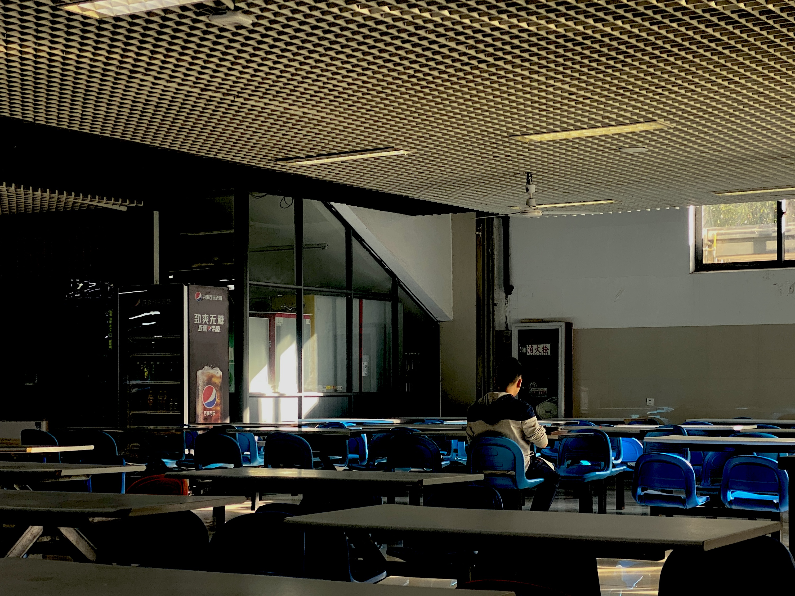

如果可以和爱人一起吃早餐就好了，她kuai起一勺不透明的藕粉，抽出手拨开袖口看那个银色的不锈钢表。半地下的食堂在阳光好的时候就是教堂，圣光斜插进来，指导我们去上天堂的早八。

为什么我们对这个场景如此的迷恋呢，对面有一个笑盈盈的男孩就好了。

她想起旧友，或许她们是读了太多的小说，各位作者不遗余力的描写这些人间的快乐，她们感动，她们焦虑。

如今她们已经亲手戳破了幻想的泡泡---那些爱慕的抽象品质一旦投射到具体的人身上，就“叭”一下溅开了，润湿在表面。