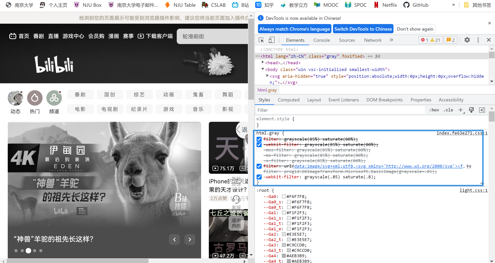

<br>

<br>

### 支持markdown中的Latex语法

2022年11月10日

> 例子： $E=mc^2$

此教程对于white主题可用：http://t.csdn.cn/pGsjx

<br>

### 支持网站灰色

2022年12月4日

时值伟人去世，目睹家乡扬州人民献花满巷，加入此功能聊寄哀思

在各大网站中，参考b站html，并没有100%的变灰，可以看出保留了一点色彩区分度，便于使用。



b站源码

```html
html.gray {
    filter: grayscale(85%) saturate(80%);
    -webkit-filter: grayscale(85%) saturate(80%);
    -moz-filter: grayscale(85%) saturate(80%);
    -ms-filter: grayscale(85%) saturate(80%);
    -o-filter: grayscale(85%) saturate(80%);
    filter: url(data:image/svg+xml;utf8,<svg xmlns='http://www.w3.org/2000/svg'><filter id='grayscale'><feColorMatrix type='matrix' values='0.3333 0.3333 0.3333 0 0 0.3333 0.3333 0.3333 0 0 0.3333 0.3333 0.3333 0 0 0 0 0 1 0'/></filter></svg>#grayscale);
    filter: progid:DXImageTransform.Microsoft.BasicImage(grayscale=.85);
    -webkit-filter: grayscale(.85) saturate(.8);
}
```

个人版本

```HTML
  <!-- 网站置灰,做成可配置的文件 -->
<% if (theme.graywebsite.enable) { %>
  <style>
    html {
      filter: grayscale(85%) saturate(80%);
      -webkit-filter: grayscale(85%) saturate(80%);
      -moz-filter: grayscale(85%) saturate(80%);
      -ms-filter: grayscale(85%) saturate(80%);
      -o-filter: grayscale(85%) saturate(80%);
      filter: url("data:image/svg+xml;utf8,#grayscale");
      filter: progid:DXImageTransform.Microsoft.BasicImage(grayscale=.85);
      -webkit-filter: grayscale(.85) saturate(.8);
    }
  </style>
  <% } %>
```

加入主题文件的`themes\主题名\layout\_partial\head.ejs`，注意加在`<head>`标签里面，位置任意。

在配置文件`themes\主题名\_config.yml`加入以下

```yml
# 网站一键置灰
graywebsite:
  enable: true
```

在此配置即可开关