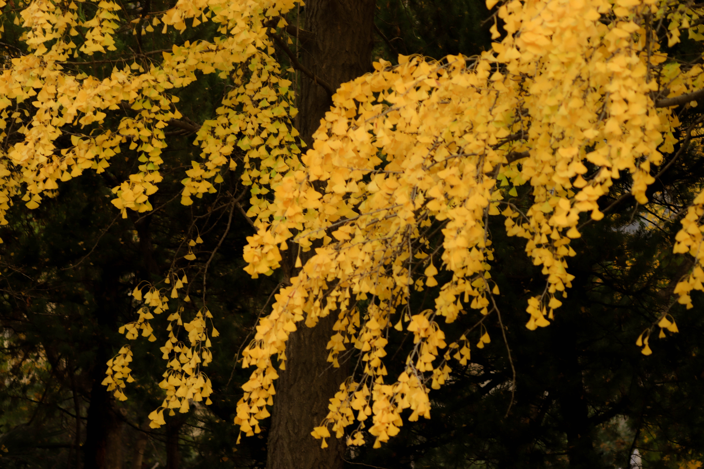
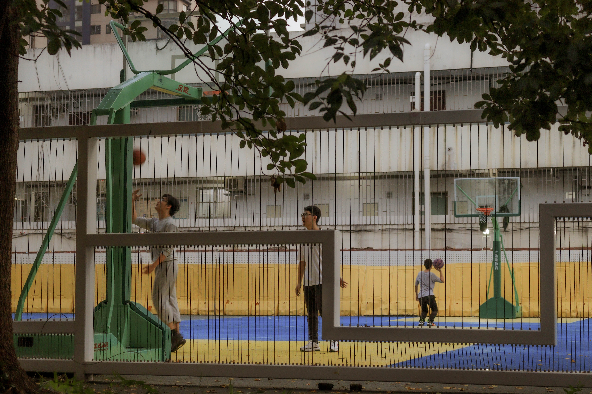
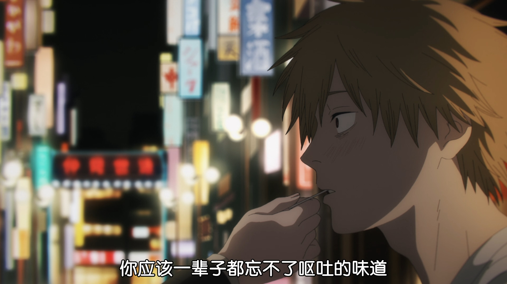
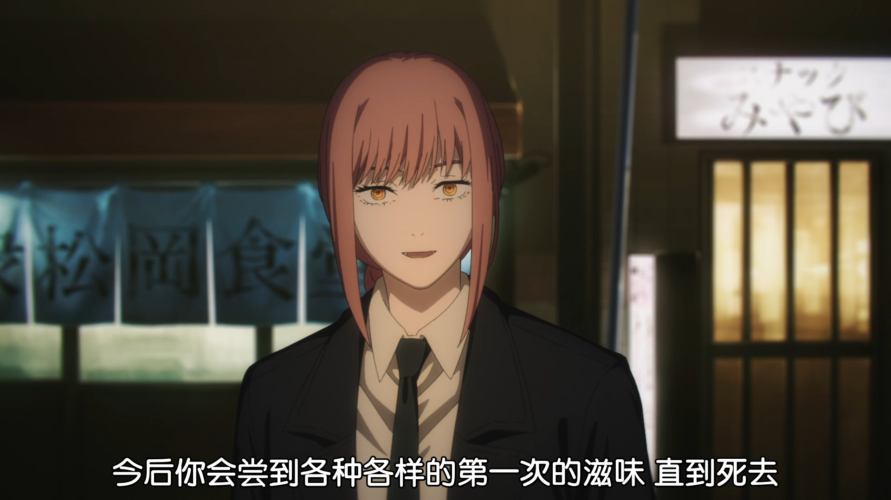
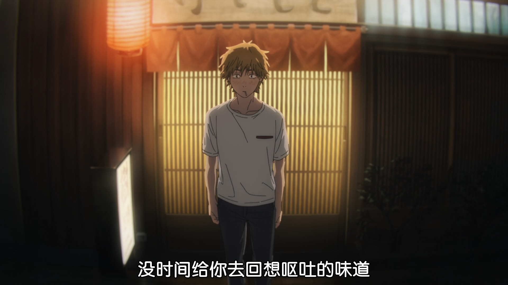
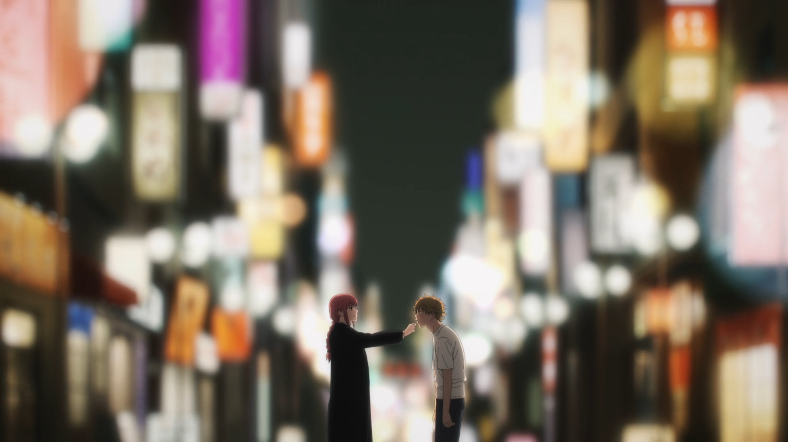

南京大学 董晓老师 俄罗斯文学经典的当代意义 2022秋 笔记

 

> 契诃夫，绝望的歌手。

剧作家，短篇小说家。

### 生平（几个小故事）

#### 幽默感

这是个天性的东西，契诃夫小时候就会开大人的玩笑。

契诃夫幼年生活在俄罗斯南部小城，穷。新年没有钱买礼物，契诃夫扮演成小乞丐去舅舅家，舅舅心软给了好多礼物。晚上舅舅来拜年，看到穷外甥有好多玩具和好吃的，疑惑。契诃夫进屋又扮成小乞丐，乐。

 

契诃夫可以带给人轻松的难堪。后来全家为了躲债，跑到莫斯科，契诃夫在本地上学，考上了莫斯科大学医学系，大学期间写幽默小说，投稿补贴家用。

毕业行医没两年，觉得还是创作有意思，成为全职作家。

 

成了作家，有了粉丝。有个彼得堡的三流女作家，两人通信，女人一直给他寄作品，钦慕他，寄了过分的礼物，有煽情的话，契诃夫全当没看见。

契诃夫后来来到彼得堡，有一场假面舞会。女作家求丈夫整了个门票。按理说假面舞会的规矩是，不能询问姓名，摘下面具。但是女人躲在门口，看着契诃夫带上面具。舞会中，一直找他跳舞，暗示。契诃夫没有挑明是否认出她。舞会最后契诃夫说，过一个月，我的戏剧在彼得堡首演。《海鸥》，剧中会提到你。

演出时候，女作家又求丈夫搞到门票。剧中，有一个女孩迷上了莫斯科的作家，给他寄了一个精巧的盒子，里面有爱慕的纸条。写的“我的心情在你书的200多少页。”

女作家翻到契诃夫每一本书的200页，看不出来。她想是不是我的书呢，一翻自己的书发现写的是：”一个女人，最好不要背着丈夫参加舞会。“

 

#### 忧郁

另一个天性，忧郁。

22岁读大学期间，吐血。作为医学生，知道这是肺结核的先兆。自己诊断一下，最多活个20年。之后他活了22年，44岁。

但是从不把痛苦的心境写在脸上。35病的很寄的时候，咳血之后了还能笑着说话。后来病重，医生劝他去德国疗养院，妻子很伤心，他编一些幽默故事宽心：

几个富人，想有好胃口。白天在外面运动，搞得自己筋疲力尽。晚上回去准备大吃一顿，这个说要吃考松鸡，那个要吃啥啥。乐颠颠回到屋里，发现厨子跑了，嫌他们给的钱太少了。

用平静的心态消解痛苦。病到快不行了，叫医生来，医生看了眼说：开香槟吧。开了香槟契诃夫喝了一杯，说再没有喝过这么好的香槟酒。侧卧着和妻子说：”我要死了“。10min以后去世了。妻子发电报给莫斯科。把遗体送回俄罗斯。

群众去接，没见到。发现契诃夫被放在装牡蛎的货车里。很生气，怎么这样对我们的大作家？

其实德国人是好心，因为只有牡蛎车厢有空调。

 

青年时是外显的幽默，存粹的幽默。后期，升华为内敛的幽默。最成熟的剧本都是后期。

抒情，忧郁，但是还是幽默的。

 

### 几个作品

##### 《在理发店》

小伙子爱上了一个女孩，未来的老丈人来理发，小伙汁理得很认真，老头说小伙汁，我女儿要嫁给一个将军啦。小伙汁撂下剪子，您滚吧。老头顶着阴阳头走了。

《变色龙》

##### 《胖子瘦子》

在此相见，很开心，互喊绰号。瘦子一看胖子官位更高，怂了，不敢喊绰号了。胖子也很烦，不欢而散。

##### 《小公务员之死》

小公务员在剧院戳了光头一下，将军说没事，小公务员却很惶恐。多次道歉，将军说不用了，看戏吧，我都忘了。小公务员一直道歉，在剧院门口道歉，又登门道歉，将军把他打出来，病死了。

 

什么样的人在任何场合都觉得好笑？一定把激情隐藏在心里了，而显得很冷。热情似火是没有喜剧精神的。那些东西参杂进来，是悲剧，高昂的，心潮澎湃的。喜剧应该是冷冷的。

### 冷

契诃夫不喜欢无谓的抒情，早年就看的透彻。

有一篇小说写，情人在花前月下约会。应该要景物描写，他写月亮不用说已经升起来了。要让读者很好的感受美景，就差费特先生躲在花丛里朗诵那《xxx》了

> **费特** 俄罗斯抒情诗人
>
> 一篇小诗，写情侣在树林里，眼泪，热吻，朝霞，小溪，没有一个动词

有人喜欢，或者不喜欢都是因为他冷。一种绝望。

 

##### 《打赌》

银行家很有钱，他要考察人在寂寞里能停多久，能不能撑过一年。在 报纸上登广告，赌注100w，每天有吃有喝，有书看（老师：可能现在中国人可以忍受的了吧，隔离）。马上来了个穷大学生，银行家观察，大学生头一个礼拜老开心了，点好吃的。

一周以后，要吃的都很简单了。来回走动，来回踱步，坐立不安。

之后开始要书单，第一批，侦探小说。第二批，言情小说。第三篇，历史小说，之后历史著作，法学著作，哲学著作。

发现越来越不焦虑了。就看书，吃的简单，学哲学的很乐。

银行家麻了，他破产了。离365天还要一天了，银行家拿着斧子来咯，一看门开了，大学生走了，留了个条子，他已经找到了生活的意义，钱没必要了。

 

登在读者文摘上，本来是一碗鸡汤。

但是发现是契诃夫写的，契诃夫怎么会端寄汤捏。

 

原文有一个结尾，读者给恰掉了。银行家后来发迹了，搞了一个晚会，感慨，大学生帮我认识了人生道理。正说着，门卫通告，有人要见你，是当年的大学生。求他，给我100w吧，我出去闯荡了10年，发现学哲不管用，还是钱好。

**大部分小说没有引人入胜的情节，随意性的开头，开放性的结尾。不以情节取胜，以情景。**

 

##### 《带阁楼的房子》 

我是一个画家。

姐姐热心公益，妹妹忧郁，天天看屠格涅夫。

怼姐姐，你这么搞慈善是没用的，要从制度下手。姐姐很生气，你就是个寄生虫，天天就说风凉话。

一天和妹妹倾吐，爱慕，妹妹说我们家姐姐做主。

第二天，画家来了，姐姐带着孩子，给他一封信，妹妹说，姐姐不同意，我昨天晚上出国了。之后画家再也没去过这个房子。

 

**建议安静的，慢慢的读。一种抒情，淡淡的哀愁，抒情。**

**契柯夫小说，情调胜于情节。(日式)**

**契柯夫的冷，在于能够发现生活的荒诞性。不好轻易的说，谁对谁错。一种美丽的无奈。**

 

##### 《第六病室》 

医生发现一个精神病，发现这人清醒的时候是个哲学家，就和他聊天。

院长看他不对劲，骗他穿上病服，也送进去啦。没法辩解，医生死在里面。

#####  《带狗的女人》 

男人想搞婚外恋，出去度假，想骗一个女人，搞俩月。

看见一个忧郁的带狗的女人天天在海边散步，去搭讪，果然上钩。过程一笔掠过。

从假期结束开始写，男人发现自己爱上了女人，开始郁闷了。

他觉得和女人呆着很坦然，没有任何的面具，觉得和妻子和同事都很虚伪，开始难过。

一次聚餐，和同事们倾诉，同事们一边吃鲟鱼，一边瞪大了眼睛看他，他动情的说完，同事们说今天这鱼有点臭。

男人忍不住去找女人的城市，到了发现女人和丈夫去剧院了。赶到剧院，两人在剧院休息时见了一面，约好一月见一面。

男人越发痛苦，只有两人幽会的这一天才是真诚的。

 

#####  《马车夫》 

车夫和丧子之痛，和客人交流， 每人愿意听完。

最后发现马总能瞪大眼睛听 ，给马说完了，安心的睡了。

##### 《万卡》

一篇童话。小孩城里打拼，给爷爷写信，回忆往昔，说城里日寄过的好苦呀，写完美美的睡去了。

##### 《瞌睡》

3岁小女孩，要给一个婴儿摇篮。她想睡觉，但是婴儿哭，女主人就要揪她耳朵。女孩掐死了婴儿，美美的睡了一觉

#####  **《主教》**

推荐

日子过的很重复，一天做弥撒，发现人群中有人像他的母亲，晚上回去觉得很奇怪，母亲对我毕恭毕敬，为什么，虽然我是主教。

后来一直带病坚持活动，去世了。

多年后母亲说我儿子怎么怎么样。

表达主教对世俗淡淡的向往。

 

### 世界三大短篇小说家

> 与法国作家[莫泊桑](https://baike.baidu.com/item/莫泊桑/132071?fromModule=lemma_inlink)和美国作家[欧·亨利](https://baike.baidu.com/item/欧·亨利/1589284?fromModule=lemma_inlink)并称为“[世界三大短篇小说家](https://baike.baidu.com/item/世界三大短篇小说家/3795192?fromModule=lemma_inlink)”

#### 莫泊桑

把传统的短篇小说写道极致了，精巧的结构来展示情节的紧张，来挖掘人的灵魂。

#### 欧亨利

欧亨利式的结尾，结构很讲究，结尾特别讲究。

《麦琪的礼物》

#####  《[警察与赞美诗](https://baike.baidu.com/item/警察与赞美诗/451319?fromModule=lemma_inlink)》 

为了进局子，开始犯罪。

吃霸王餐，结果被扔出去。调戏妇女，跟了个妓女。偷，盯上了一个惯犯。

路过教堂，在唱赞美诗，警察决心改过自新，却在这时候被条子盯上，你在这瞎晃什么。给抓进去了

##### 《最后一片叶子》

不是挺温馨的故事吗。

落魄画家给女人画了一片不掉的树叶，在雨夜挂上去，自己却淋雨死了。

欧亨利不会超过莫泊桑，深度不够。

#### 契诃夫

打破套路，写另一种类型。

一种欲辩已忘言之感

 

### 剧作家

独幕戏剧，吸收了法国剧本的优点，又是俄国主题，27、8岁大家就很喜欢。

##### 《蠢货》

一上来女主，墙上挂着丈夫遗像。老仆在安慰她，夫人，您已经哭了一个月了，我们庄园旁边有一只军队，你应该请年轻的军官来锎晚会。女人骂她，接着哭。

这时来了一个40岁的退伍军人，要丈夫生前借的1000卢布。女人说，我们得秋收之后才有钱。开始对骂，女人说要决斗。男人问怎么决斗，女人说，丈夫留了一个枪，还有一个子弹。

女人说，你教我一下怎么打，男人过程中爱上了她，这女人好奇怪好可爱，说不要决斗了，女人就要。

仆人一听决斗，慌了，来咯一看，俩人抱在一起了。

#####  《求婚》 

老地主，觉得女儿嫁给年轻地主好，年轻地主觉得娶邻居女儿好。年轻地主来拜访，不敢直说，就开始瞎扯，和女儿扯我们的缘分，你家的河流过我的庄园，怎么怎么。最后因为耕地的所有权吵起来，父亲来劝和。

年轻人又开始瞎扯，扯家里的装修高雅，画好看，狗名贵，和我家的比怎么怎么样。又吵起来了。

父亲说你们想结婚吗？想呢。别吵了。结婚吧

 

#### 易卜生

欧洲当时最有名的剧作家，契诃夫不喜欢，有嫉妒。

觉得易卜生的戏假，情节紧张激烈，观众容易入戏，人物争锋相对，环环相扣。

> 曹禺崇拜易卜生，成名作《雷雨》古希腊悲剧+易卜生戏剧化。思萍认出这家是哪家，和周朴园在客厅寒暄，周朴园瞎问问，她争锋相对的回答。

契诃夫总想实现戏剧改革的梦想。希望能不要情节紧张激烈，要生活的日常常态。

契诃夫想写一个成功的大戏，把他的理念在舞台实现。

 

### 与托尔斯泰

托尔斯泰很喜欢契诃夫，大他32岁，把他当儿子看。赞口不绝，给他捎信：请来拜访我。

来到托尔斯泰的豪华大庄园，仆人说，前面花圃里穿粗布衣服剪花的老人就是。

契诃夫1.92m，托尔斯泰1.6m。

托尔斯泰请他洗澡，衣服一脱，小河里一泡。上来喝喝茶。

第二次来见，契诃夫开始耍滑头。托尔斯泰拉着他的手在林荫道里散步，契诃夫拉拉他的胡子，说我是医生，你是不是年轻的欲望太多了。

 

#####  《宝贝儿》 

契诃夫的小说。

女人可爱，大家都叫她宝贝儿。

嫁了第一个丈夫，木材商人，说这个森林是保护的。商人死了，嫁给剧院经理，开始说戏剧是最辉煌的事业，经理死了。又嫁给兽医，说动物是人类的朋友。兽医死了，女人不知说啥了。发现商人有个私生子，已经上大学了。

女人去照顾大学生，开始说，青年是国家的栋梁！

 

本意是讽刺的。但是你要记得托尔斯泰对女性的态度。。。

托尔斯泰在医院，看到说写的很好，要收到我的最佳文学选里面。契诃夫买了书来拜访他，托尔斯泰表示，为什么要收录呢，我希望全俄罗斯的女人向宝贝儿学习！

契诃夫很尴尬，打着哈哈溜了。

 

### **1895 《海鸥》**

听说契诃夫要写一个大戏，朋友们很支持，说你已经是一个成熟的小说家啦，肯定可以的。

1896 10月，在彼得堡皇家剧院上演。著名小说家契诃夫的大戏。那场面。。契诃夫带着家人来看首演。

一般戏剧5幕，契诃夫只有4幕。

按理第一幕要鼓掌，但是第一幕看完，观众不懂，不鼓掌。第二幕也是，觉着人物各说各的。

到了第四幕，演员都慌了，台下吹口哨跺脚的都有了，演员越说越快。托尔斯泰从第一排站起来骂骂咧咧走了，“请转告契柯夫，叫他老实写小说吧”。

契诃夫本人也没看完就溜了，晚上朋友去找他，怕他想不开，他留了个纸条：别来找我。润回南方克里米亚别墅了。

契诃夫怪朋友，瞎几把起哄，说我能写好的戏剧。现在彼得堡各大报纸评论“谁家的海鸥瞎几把乱叫''。丢大了。

《海鸥》滑铁卢，但是是他第一部代表戏剧。此后，契诃夫逢人就讲，我再也不写戏剧啦，即使他的第二部戏剧已经完成。

 

#### 斯坦尼斯拉夫斯基

契柯夫未来的导演。

此人儿时就喜欢演习，逼着家人看他们今天哈姆雷特明天奥赛罗。叫妹妹搭戏，后来叫哥哥来演，自己做导演。

最后把工厂给geigei，自己做导演去了。

遇到 丹钦科 ，在莫斯科一拍即合，斯坦尼斯拉夫斯基钱多，好办。他们去艺术学校找15、6岁的好苗子，其中就有契诃夫未来的妻子。

 

##### 《海鸥》再次上演

1898年剧院开张了，好的剧院要有经典戏剧和当代戏剧。当代戏剧他选了《海鸥》。可是契诃夫不想再丢人啦。斯坦尼斯拉夫斯基找契诃夫妹妹的追求者，给他做工作。最后契诃夫同意了，但是我不到场，只演一次。

《海鸥》写了40岁的母亲，一位女演员。她的儿子是文青，20岁，励志改变俄罗斯戏剧文学。儿子写了一部大戏，在庄园表演。文青希望女孩妮娜演这个戏，

戏剧演出，都是抽象的台词。母亲说：哎哟，有颓废派的味道。儿子听出是讽刺，和母亲矛盾。

母亲有个作家情人，儿子和作家冲突。

后来妮娜被作家拐跑了，儿子和作家冲突。

管家女儿喜欢文青，但只能嫁给小学老师。妮娜给作家甩了，生了孩子，成了地方的三流演员。

某天文青百无聊赖，打死一只海鸥，说有一天我也想打死海鸥一样打死自己。文青发表了小说，有了读者来信，但他知道自己只是应和读者媚俗。

最后在幕后自己开了一枪，打死自己。

 

斯坦尼一点一点扣戏剧，这里停顿5s，那里怎么怎么样。要通过表演让观众体会到日常生活中的冲突，潜台词。

他要求演员充分的感受体验角色，在舞台上要忘记自己。要感受他的痛苦和快乐。要敏感要嫉妒。要在排练的过程中充分的体验。要树立看不见的**第四堵墙**（演员和观众之间）你的眼睛没有观众，你在舞台上生活。

 

二人相互成全。1898，剧院开展，两周后演出这戏。

演完了剧场安静了足足6s，观众才回过味来，有了掌声，谢幕谢幕，”请作家请作家“。

作家在克里米亚呢，又溜了。

斯坦尼打电报给契诃夫，契诃夫说不行，别安慰我了，我都睡着了。

直到莫斯科的报纸送来，契诃夫速速回来，和斯坦尼说我的第二部戏已经写好了。

>  一个月后，斯坦尼斯拉夫斯基与丹钦科联合执导的[契诃夫](https://baike.baidu.com/item/契诃夫/63846?fromModule=lemma_inlink)名剧《[海鸥](https://baike.baidu.com/item/海鸥/1342809?fromModule=lemma_inlink)》获得轰动性成功，标志着一个新的[现实主义戏剧](https://baike.baidu.com/item/现实主义戏剧/3871460?fromModule=lemma_inlink)流派的诞生。就如斯坦尼斯拉夫斯基后来总结所述：“如果说历史世态剧的路线把我们引向外表的现实主义，那么，**直觉和情感的路线却把我们引向内心的现实主义。”** 

 

####  《万尼亚舅舅》 

第二部戏剧。忧郁的风格

####  《三姊妹》 

第三部戏剧

三姊妹想到莫斯科去，到莫斯科去。父亲把他们带到外省，死去了。都是知识分子，会6门外语。然而在这个小城只要会俄语就够了。

 

### 绝笔 《樱桃园》

> **感觉上像悲剧，思考起来却是喜剧**

是契诃夫的最后一部作品 ，在契诃夫生日当天演出，演出非常成功。在但是和斯坦尼斯拉夫斯基观念不一致，契诃夫觉得这是喜剧，你们却演的悲伤。

契诃夫的夫人在里面演女主，导演要求要哭戏。夫人回家，契诃夫却说，不要流泪啊，眼泪噙在眼眶里就好，不要这么多哭腔。

樱桃园的封皮就写着：**四目喜剧**。

#### 概要

一个关于庄园的故事，美丽的俄罗斯内地庄园，种了千棵樱桃树。到了19th末，庄园却维持不下去了，因为资本主义进入俄国。女主 **郎涅夫斯卡雅** 有过一个儿子，5岁在樱桃园淹死了。庄园主在巴黎和情人生活，情人把他骗过去，骗完了钱抛弃。后来有了一个养女。

郎涅夫斯卡雅 思念故乡，祖国，回到樱桃园。哥哥是一个游手好闲的贵族，爱好打桌球。庄园里有照顾他们的老仆人，淹死儿子的家庭教师穷大学生，大学生现在还没毕业，有革命的幻想。农奴的儿子 **罗巴辛**，文化不高但是适应资本主义发展，如今成为年轻的商人，

得知庄园岌岌可危，还不起利息，马上要拍卖了。主角和哥哥想把庄园买下来，但是没钱。商人罗巴辛表示，你这庄园位置很好，在城郊，但是离火车站近。城里有很多暴发户啊，周末不知道去哪潇洒，你把樱桃树砍了，建成别墅，出租或者卖掉，有这个计划银行会给你贷款，可以用来拍卖。兄妹拒绝了，樱桃园是写进俄罗斯百科全书的，这样砍了算什么。

罗巴辛 很想帮助女主人保住这块地，很是爱慕女主人。小时候被父亲打，女主人给他洗脸，包扎，在樱桃园的育婴室。

到了拍卖的那天， 罗巴辛 买下了樱桃园。当他拿到庄园的钥匙的时候，很感慨。一个农奴的儿子，今天买下了庄园。郎涅夫斯卡雅很伤心，这时巴黎情人病了，求她原谅，郎涅夫斯卡雅抹抹眼泪，又回到了巴黎情人身边，

养女被穷大学生拐走了，大学生说这个庄园没什么，每棵樱桃树下都有农奴的尸体。而整个俄罗斯就是个大庄园，我们应该去新世界。台词：“别了旧生活，你好新生活。”

老仆被遗忘在庄园里，说要把他是送到养老院，其实被人忘记在庄园里了，最后坐在庄园的椅子上死了，这时候，砍树的声音由远即近。

 

#### **喜剧?悲剧**

很多人认为不是喜剧，最后樱桃园都没了。

##### 高尔基看法

高尔基认为是喜剧，原因却很怪。高尔基在工人运动前夕写了一个文章评论 《樱桃园》，认为 《樱桃园》写了庄园主，庄园主剥削阶级的灭亡，兄妹二人是可笑的，到了他们退出历史舞台的时候，却装腔作势。 《樱桃园》揭示了贵族剥削阶级滑稽可惜的结局。

兄妹确实可笑。郎涅夫斯卡雅出门还要点最贵的菜，乞丐要钱都给一个金币，仆人却都没有面包吃嘞，吃豌豆。劝她不要这样大手大脚，郎涅夫斯卡雅说已经习惯了，不知不这样怎么做。

哥哥没钱愁眉苦脸，一听说打台球了，还是颠颠的乐。

高尔基认为穷大学生代表了俄罗斯的未来。

高尔基要通过这样的阐释来鼓动工人运动，做了一个政治的意识形态的阐释。

 

##### 契诃夫看法

但是契诃夫对于每个人都讽刺，大学生也讽刺，毕不了业什么失败者。勤奋的商人也被讽刺。但是郎涅夫斯卡雅即使被讽刺，还是优雅善良，敏感、情感丰富的人。

这部戏写出了人类共同的精神困惑，不同的民族国家，都会有的情节。

##### **“樱桃园情节（complex）”**

每一个民族国家发展的同时，一定会牺牲掉美和诗意。生活变得越发的边界，节奏越发的快，但是美和诗意需要慢节奏。

一方面社会迅速发展，一方面在失去美好的东西。

“樱桃园情节”是个普遍的东西。

老师：1988年，南京大学在广州路，篮球场和围墙之间的银杏树林，30m宽，早晨去晨读，闹中取静。

当时搞破墙运动，喜迎改开，北京大学把墙推了搞中关村。南京大学也把墙推了，篮球场得留着，树林砍了。

南京大学鼓楼校区银杏树

老师提到的篮球场，已经被翻新

全世界的观众都会被剧本触动，解释了该剧经久不衰的原因。

##### 喜剧的标准

但是为什么契诃夫说这时喜剧呢**？首先得定义喜剧的标准。**

标准是赵本山的小品吗，让大家笑出来就是喜剧。

但是樱桃园整体是忧伤的。

黑格尔在美学里面定义的，喜剧人物和悲剧人物不同之处在于，**悲剧人物崇尚他和现实不协调的理念，在和外部世界的冲突中毁灭。**悲剧人物看到了这个与现实的抵触，但是去抗战，搏斗，毁灭。标准是最后是否毁灭了。

eg：俄狄浦斯王 哈姆雷特，奥赛罗，李尔王。

喜剧人物呢，清楚自己内心的理念和外部的不协调，对抗。**但是他们能够做到“逍遥自在、随遇而安”用一种超然的态度。最后超越冲突，生存下去。**

郎涅夫斯卡雅 每次哭泣，都是带着潜台词，希望达成协议， “罗巴辛 你买下这个庄园吧，好让我轻松的离开。”

##### 《欲望号街车》

 ***A Street Car Named Desire***  田纳西·威廉斯 。作者崇拜契柯夫，把樱桃园的故事搬到美国南部。

这是一部悲剧，女主人毁灭了。

女主南方的庄园寄了，去找北方姐姐投靠，姐夫是个波兰裔工业产业工人，很有力量。女主和姐夫一直冲突，最后上升到暴力，姐夫将她强暴了。

美的毁灭。

### 悲剧的核心？

以上是从人物界定喜/悲剧。

根本上决定悲剧喜剧，中国人可能觉得，让我感到快乐的喜剧，让我难过、忧郁、感伤流泪的是悲剧。或许因为**comedy**和**tragedy**的翻译变成了悲/喜剧。这是日语翻译，中文借鉴，给人带来误导。

最核心的问题在于，这个作家从什么立场去写的。看剧组家 艺术观照的立场。这可以矫正我们的刻板印象。

**aesthetic**美学，真正含义是感受、体验，相对于理性的思考分析。审美的对象可以是美也可以是丑的。

>   一件事情，你用感情去体验他是悲剧，理性观照就是喜剧了
>
> ---霍勒斯·沃波尔 

> **理性的幽默（喜剧）高于理性的激情（悲剧）**
>
> ---马克思

当我认为审美观照的对象是崇高的，无比高大的，写出来是悲剧，**悲剧的核心是崇高。**

如果不用一直崇敬的心情去仰视他，俯视、平视，滑稽感就出来了。是怀着一种崇敬，还是戏谑去写的。用戏谑去写，再崇高的东西也能成为滑稽可笑。写死亡，写民族的苦难，沉浸在苦难中，一定是悲剧。

 

#### 从伤痕文学到《芙蓉镇 》

20th70年代末，改开后，文学开始发展，第一个出现的伤痕文学。作者和读者沉浸在痛苦之中。沉浸在当年的苦难去反思痛苦，怀着崇高的情感，不能再去重复他了。写出的都是悲剧。

到了1981，伤痕文学结束啦。

 古华1981 《芙蓉镇 》中篇小说，整体是悲剧，但是写文革苦难的视角发生了一点变化，标志着对文革的文学书写进步了一点，带着一点戏谑。右派要结婚，问主任，主任要他们写一篇对联 

> 两个*狗男女*，一对黑夫妻，横批：鬼窝 

如果能跳过崇高伟大，跳过苦难，才能达到喜剧。

 

#### 例子：列宁和🐟

前苏联导演，要求一个场景，能够演成悲剧和喜剧。导演给出一个著名的红色故事，1918年列宁工作累到了，警卫员搞了一条鱼，列宁舍不得吃，说还是给保育院的孩子吧。

演员不懂，悲剧好说，就这还能演喜剧？

喜剧：列宁一听有🐟，乐，立刻不工作了，端过来闻闻，脸色越发的寄，最后说还是给保育院的孩子吧。

 

### 20th喜剧发展

契柯夫并不感伤，樱桃园情节是人类绕不开的死结，永远的困顿。其实是一种绝望。

 布宁 不喜欢契柯夫这种幽默，他笔下的庄园就是一首挽歌。

喜剧的主人公没有希望，面对困境是绝望的冷笑。20th喜剧发展越发深化，悲喜剧。用喜剧的眼光去观照体验只有悲剧表达的情感。当人的绝望之情达到巅峰时候。

20th中叶，荒诞派悲剧，人类的绝望之情在艺术上的体现达到了巅峰。

而荒诞派都认为自己是喜剧。

 

#### 米兰昆德拉《玩笑》

大家都想去天堂，我们都往里面挤进去啊，进去后门关了，我们发现这时地狱。

映照现实，苏联的终结。德国，大家当时多拥戴希特勒啊。

*为什么我们前途光明，我们满腔热情奔向未来时候，发现在饿死人。*

不如冷笑，这是面对苦难最智慧的方式。

 

《椅子》《犀牛》《秃头歌女》的作者，都把契诃夫当作前辈。任何民族逃不出樱桃园情节。所以契柯夫并不感伤

**丢了又怎么样，我们继续往前发展，还有新的痛苦等待着我们。**

不禁想起玛琪玛小姐的话

 

#### 影响

契诃夫，绝望的歌手。

黄金时代最后一位诗人，印象力遍布全球。

尤金aomier 先崇拜易卜生《雨下的欲望》，后来《通向欲望的慢慢长路》

萧伯纳 

曹禺从易卜生式的《雷雨》到契诃夫式的《北京人》都是这个路数。

 

 

19th黄金时代结束啦，下面进入20th。

20th苏联关起门来玩，经济关门实在不好，但是俄罗斯作家文学上关起门玩出了花。

20th苏联作家的创造环境，和前辈比，没有改进，一样的糟糕。之前是被沙皇限制，苏联更严格了。但是还有很多传世名作。对自由的书写，很独特。