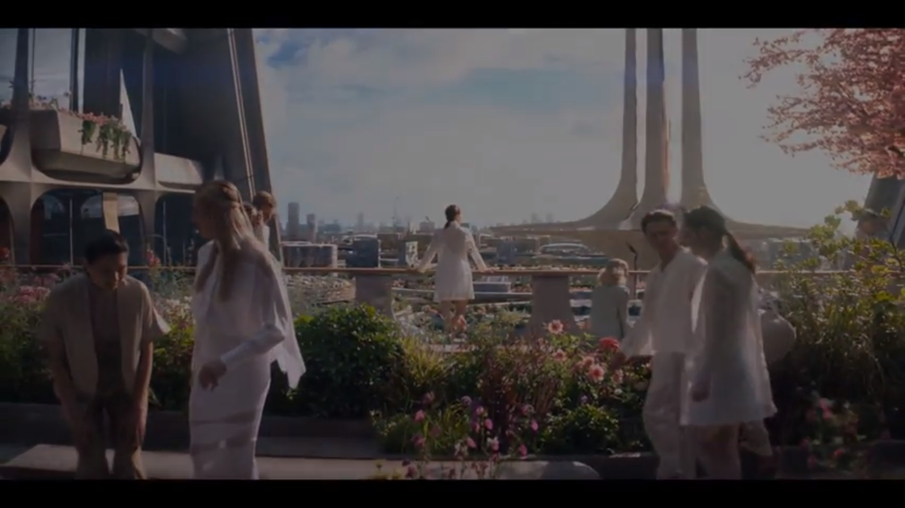
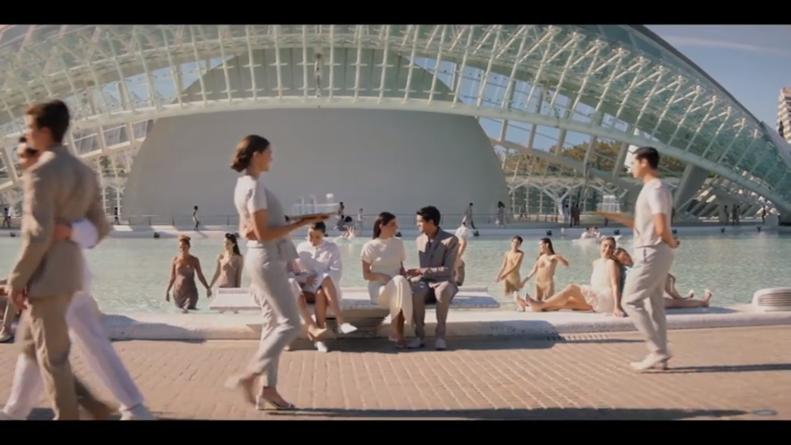
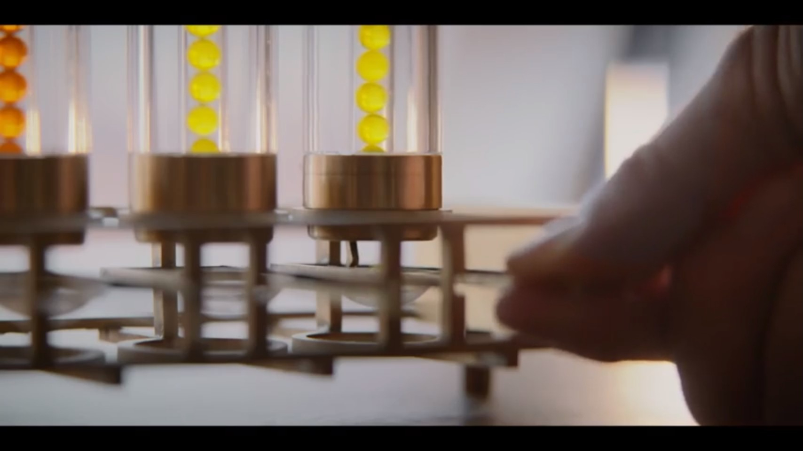
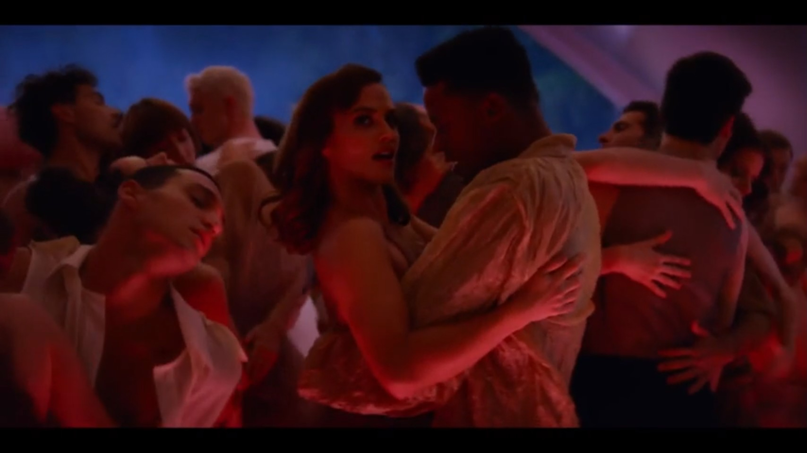
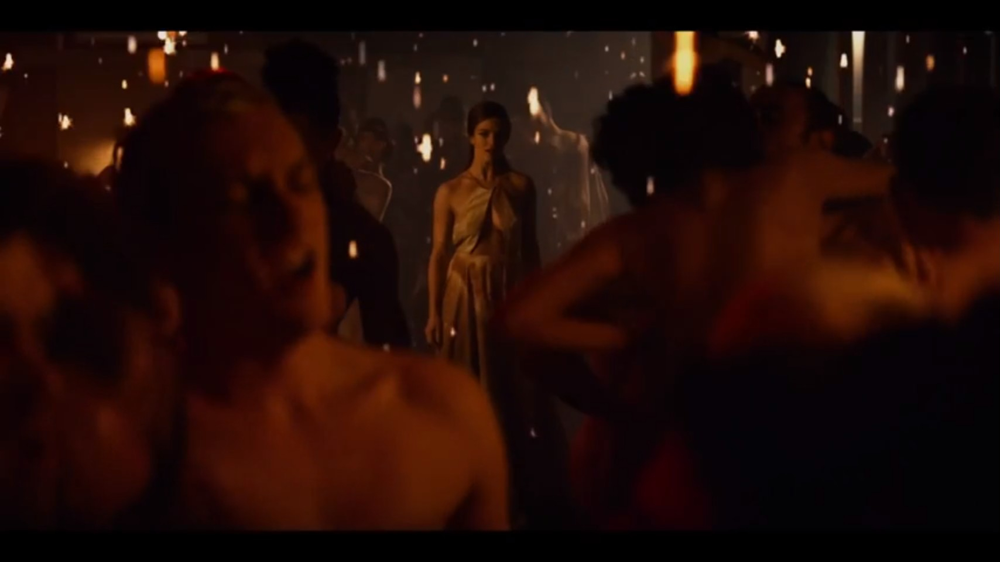
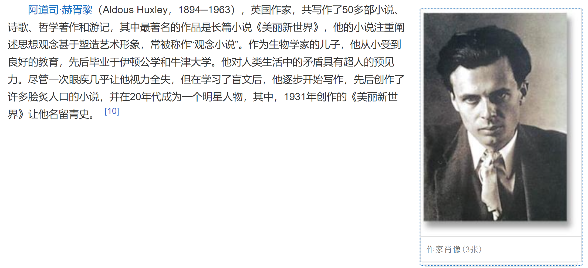

南京大学 董晓老师 俄罗斯文学经典的当代意义 2022秋 笔记

 

19th末-20th初（前20年） 俄罗斯文学的白银时代

白银时代只是艺术理念与黄金时代不同，成就还是很高的。以象征主义、现代主义为代表，是俄罗斯文化转型的阶段。

## 扎米亚京

> 地上不可能建立天国，天国是彻底的幻想；矛盾永远存在。所以，没有什么终极目的，有的，只是进步。”
>
> ----（《[顾准文集](https://www.zhihu.com/search?q=顾准文集&search_source=Entity&hybrid_search_source=Entity&hybrid_search_extra={"sourceType"%3A"answer"%2C"sourceId"%3A1979304373})》，贵州人民出版社一九九五年版）

 

### 引子--苏联对文化的管理

苏联成立头二十年，布尔什维克政党没有狠狠管理文化，直到列宁去世。

列宁曾在文章《党的组织与党的文学》中写道：“文学是党的事业的一部分，党有责任义务去管理**文学**。”

这个想法没来得及实施，列宁去世了，是斯大林来执行的。

为什么列宁会说这种反动鬼话？中国翻译疑惑，开始怀疑是不是翻译错了。

俄语**文学**一词有文学、文字、出版物的意思。

中国翻译恍然大悟，中共中央编译局，一段时间将该文翻译为“党有责任义务去管理**出版物**。”

事实上列宁就是那个意思，党管理文学。

### 苏联作协

苏联作家要统一管理，于是设立作协，作协里面有党组织书记。

1934斯大林委托高尔基，组织一批御用文人、理论家、批评家，来指定一套原则“社会主义现实主义”作为苏联作家唯一的创作原则:

- 美学上：历史的具体的现实的描写现实生活。不可以象征、荒诞、浪漫。
- 思想上：同时必须结合用社会主义共产主义的思想教育和改造读者。

**苏联作协会议2999/3000人投票通过，没有投票的就是扎米亚京，**后来被驱逐出境了。

### 《我们》

代表作《我们》科幻小说

1927写完，1928在德国出版，随后英文法文出版。1988才在苏联出版。

 

**苏维埃宪法第一条，没有剥削阶级。**不得不说真的是人类的创举，灯塔。政权建立后，人民热情高涨充满理想主义，斯大林三个五年计划10年完成，苏联工业体系世界第二。

在这个热烈的时代，扎米亚京少有的冷静的观察了，这种热情，这种运作方式可能带来的灾难。**可能的威胁--集权主义。**

#### 内容

科幻体制，公元30th，地球文明达到高度，科技生产力高度发展，大一统王国，国民只从事高精尖的科技研究，研究火箭来吧地球的高度文明传到蛮荒的星球上。

电视剧 美丽新世界 

美丽新世界中最喜欢的设定 毒品”Soma“被大家当作必需品分发 

王国只有一个领导人，人民不生病，只有一种，你不可有灵魂，有灵魂会被处以死刑。人民没有性别只有编号，男主D503，女主I330，都是工程师。这意味着只有我们没有我，统一用餐统一休息，不可拉上窗帘。国王允许性生活拉上窗帘，抽签配对。

美丽新世界则是用淫趴来表现 

男主D503发现自己爱上了女人，但是觉得是不对的，**两相厮守的爱是蛮荒时代的感情**。

Everyone belongs to each other 但是女主有了特别的爱人 

I330很勇敢，和他说我也对你有感觉，我们不如研究火箭，一起去蛮荒的星球，D503胆怯了，计划败露，I330被处死，D503自愿做了记忆回退手术忘了她（失去了灵魂）。

 

**事实证明极权主义确实是20th最大的危机。**德国30年代苏联20年代-结束，美国徕卡西50，朝鲜，中国506070年代

社会没有灵魂没有个性将是是么样，描写的很好。

### 反乌托邦文学三部曲

西方作家非常受启发。英国作家赫胥黎深受启发写了《美丽新世界》：人的异化，科技与文明。

乔治奥维尔受启发写出《1984》。

《我们》《美丽新世界》《1984》并称20世纪反乌托邦文学三部曲。

**其中对极权主义批判最深刻的是《1984》，但是乔治奥维尔本人也承认构想源于《我们》。**

 

### **乌托邦** 的概念

来自托马斯-莫尔

>  **《乌托邦》（Utopia）**是英国空想社会主义学者[托马斯·莫尔](https://baike.baidu.com/item/托马斯·莫尔?fromModule=lemma_inlink)创作的游记，首次出版于1516年。 

理念一直可以追溯到柏拉图《理想国》。**是人类的天性，对未来的构想，一种解决方案。**

- 一种针砭现实（现实主义的描写）
- 另一种不想现实，构想未来。而这一定是参考的现实的问题。**通过对理想的勾画反照现实，对现实一种鞭策。（**浪漫主义的幻想）

 

##### 《*乌有乡消息*》

> 威廉·莫里斯
>
> **《*乌有乡消息*》 News from Nowhere** 是一部长篇政治幻想小说。

针对19th极其不理想的现实。

 

切实际的就不叫乌托邦幻想了，**但是乌托邦对于现实是有积极意义的，对人类的进步是有益处的。**我们需要对现实各种途径的批判，**因为现实总是有缺陷的。**

 

### **国家乌托邦主义**

20th以前，乌托邦是知识分子对于未来的幻想，如果执政者想把美好的幻想变成现实，就成了国家乌托邦主义。

20th很大的灾难是极权主义，因为执政者想把天国的构想拉回现实，可是现实需要现实主义，不可以有太多的幻想，**将书斋里的幻想付诸实践会带来全民的灾难。**

eg：

- 希特勒，雅利安人是最好的人种（当时德国确实吊打），如果雅利安人通知世界，这是福音啊。这给人类带来了灾难。
- 斯大林，无产阶级专政统治世界，不能有富农地主--农业集体化，1929-1933饿死1000万，600万人饿死在最富饶的粮仓乌克兰。
- 我们1957-1958的理想，15年超英20年赶美，南京大学也要炼钢，建高炉，中文系把铁架子床炼了交上去，这是中文系今年的钢产量，河南四川湖北江苏北部饿死的最多。灾难是来自我们的实践。

**乌托邦存在知识分子头脑里时候，一但以一个行政的方式全民付诸实践的就成了人类最大的苦难。**历史学家总结20th最大的灾难就是这样。

 

**国家乌托邦主义是应该被批判的**

> ”**地上不可能建立天国，天国是彻底的幻想**；矛盾永远存在。所以，没有什么终极目的，有的，只是进步。”
>
> （《[顾准文集](https://www.zhihu.com/search?q=顾准文集&search_source=Entity&hybrid_search_source=Entity&hybrid_search_extra={"sourceType"%3A"answer"%2C"sourceId"%3A1979304373})》，贵州人民出版社一九九五年版，第三七○页）
>
> 这也是秦晖《[自由、乌托邦与强制](https://www.zhihu.com/search?q=自由、乌托邦与强制&search_source=Entity&hybrid_search_source=Entity&hybrid_search_extra={"sourceType"%3A"answer"%2C"sourceId"%3A1979304373})》那篇长文说的，乌托邦或者理想都有，但不可以以暴力以强制来实现，中世纪的欧洲是如此，甚至希特勒的第三帝国也是如此，斯大林更是如此，至于中国，我们的大跃进和文革其实比斯大林搞的政策更惨烈。
>
> **在尘世建立天国可以，但不可以以暴力和牺牲个体**，否则哪怕只实现1%的天国，也要消灭99%的尘世之人。人即是人，有七情六欲，这个是人性所在，除非消灭人性。当然，人所组成的政府，也仍然有人的因素在，如果没有制衡和约束，只是一个更恶的人。[波尔布特](https://www.zhihu.com/search?q=波尔布特&search_source=Entity&hybrid_search_source=Entity&hybrid_search_extra={"sourceType"%3A"answer"%2C"sourceId"%3A1979304373})就是那个试图在地上建立天国的人，并且宁愿因此消灭99%的人。

 

文革其实也是带有理想主义的，别忘了全称是“文化大革命”。但百万人被折磨死，全国经济垮了。后来告别了乌托邦，改革才发展。

 

### 个人闲话

上这课之前估计了一把自己看过的俄罗斯文学，都是传统书单上的长篇小说，完全没想到反乌托邦也会在此出现。

反乌托邦是朋友送的礼物，《美丽新世界》《1984》《动物庄园》合集，自然而然误认为这才是反乌托邦三部曲。

三本里面最喜欢《美丽新世界》*Brave New World*  翻译成美丽还是欠点意思

> **brave**  1  
> [Date: 1400-1500; Language:  French; Origin: *Old Italian* and *Old  Spanish* bravo *'**brave, wild'***, from *Latin* barbarus;  **BARBAROUS**]
> **very  good**
> 　*Despite their captain's brave performance, Arsenal lost  2-1.*
> **brave effort/attempt**
> 　*the brave efforts of the medical staff to save his  life*
>   **brave new world**
> a situation or a way of doing something that is new  and exciting and meant to improve people's lives
> 　*the brave new world of digital  television*

可以看出brave 意为**very  good** ，  **brave new world**甚至是一个固定用法。

或许“万岁新世界”有点感觉？虽然有些意译过度。

 

作为1931年的科幻，现在读来依然不违和。《1984》和《动物庄园》是从个体视角直接描写国家乌托邦的现实黑暗，《美丽新世界》和《我们》则是先极力写乌托邦的幻象，再展示人间天国的绝望。

《美丽新世界》开头的描写很资本主义，人的胚胎由工厂生产，一产生就被定为abcd等级。上等人极致的享乐，性自由、物质丰富，下等人自发低人一等，做打扫工作。

但是细看就会发现是走偏了的共产主义。物质极力发展，人们笑容洋溢，却是通过毒品达成的；阶级稳定，是通过从小的洗脑教育完成的。

而用野蛮人（savage）的世界与天国对比，野蛮人就是我们的生活，没有永葆青春，生活不断有真实的痛苦。在月光下野蛮人男主被追杀的片段，极尽惨淡的诗意、悲剧美。

> 我不要闲适。我要诗，我要真实的危险，我要自由，我要善良，我要罪恶。
>
> ---《美丽新世界》

 

最后来一个 阿道司· 赫胥黎，眼神真nb。

 他的祖父就是生物学家、[进化论](https://baike.baidu.com/item/进化论/18587?fromModule=lemma_inlink)支持者[托马斯·亨利·赫胥黎](https://baike.baidu.com/item/托马斯·亨利·赫胥黎/5069547?fromModule=lemma_inlink)（Thomas Henry Huxley）。

