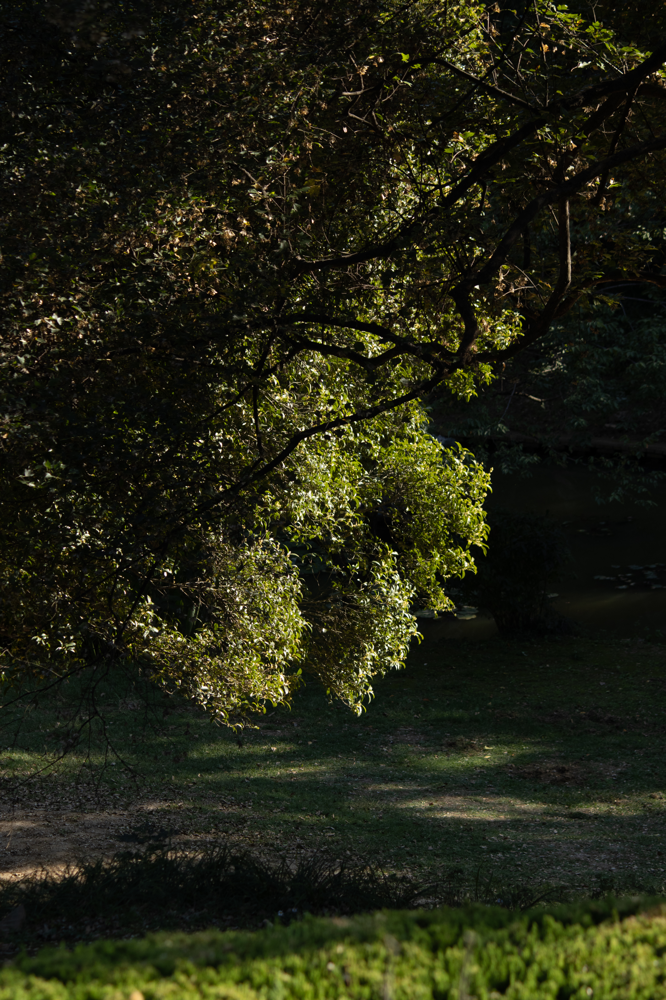
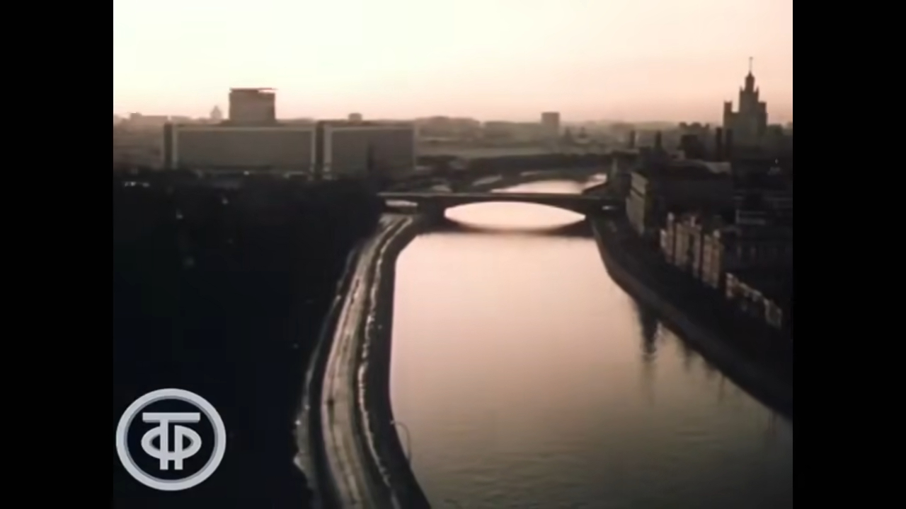
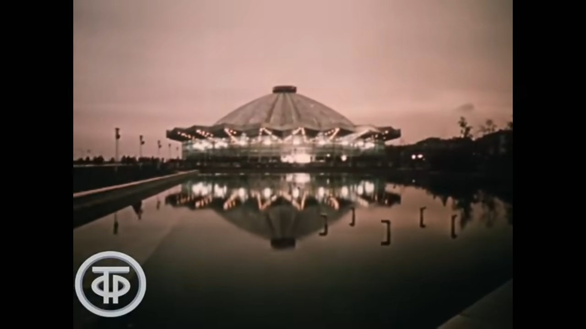
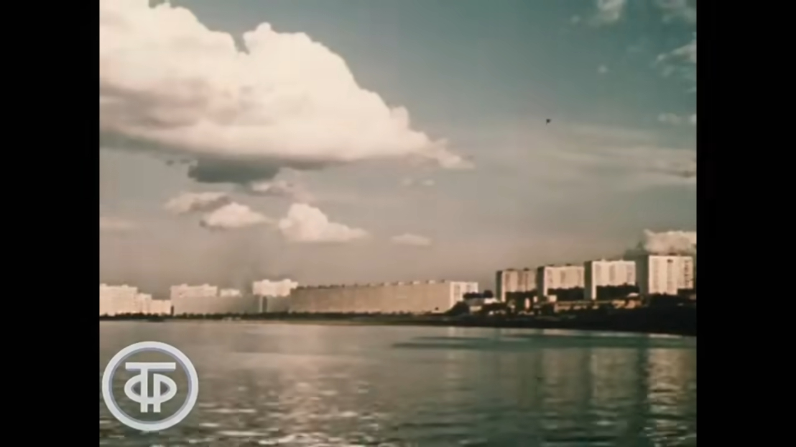
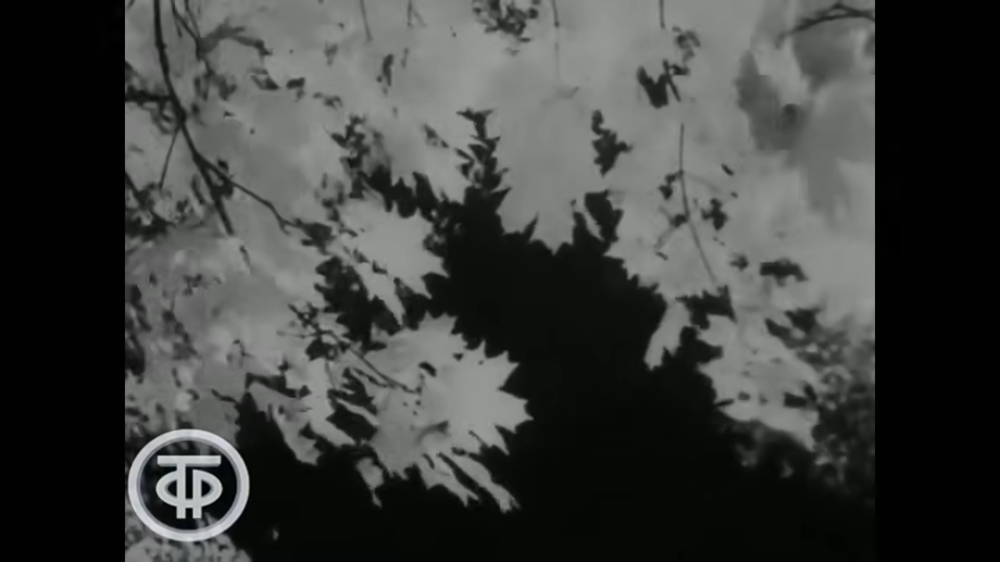
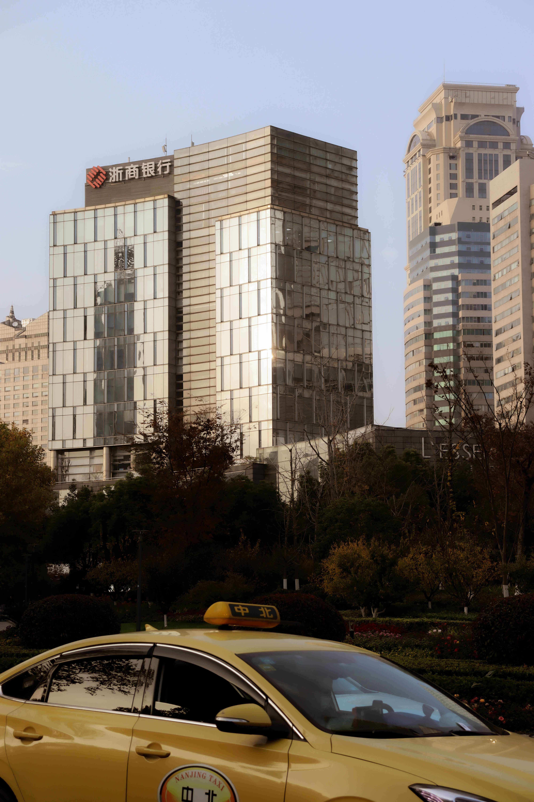
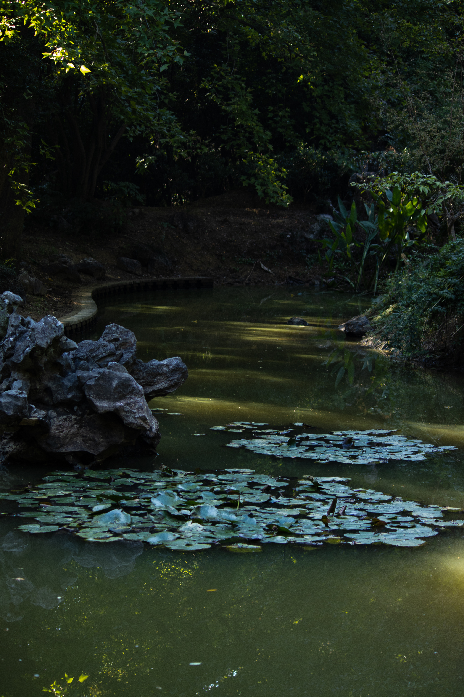
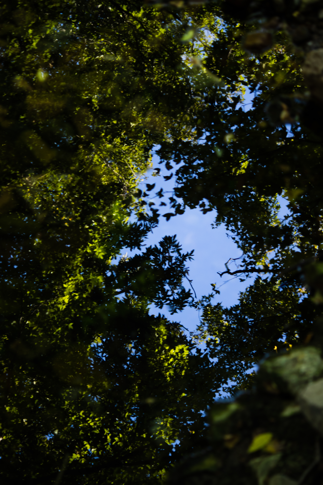

<iframe src="//player.bilibili.com/player.html?aid=68649233&bvid=BV1rJ411g7kY&cid=118977079&page=1" scrolling="no" border="0" frameborder="no" framespacing="0" allowfullscreen="true" width="100%"> </iframe>
 

> Не слышны в саду даже шорохи
>
> 花园里连簌簌声都没有
>
> Всё здесь замерло до утра
>
> 这里一切都静下来一直到清晨
>
> Еслиб знали в ы как мне дороги
>
> 要是你知道，对我来说是多么珍贵
>
> Подмосковные вечера
>
> 莫斯科郊外的晚上
>
> Если б знали вы как мне дороги
>
> 要是你知道，对我来说是多么珍贵
>
> Подмосковные вечера
>
> 莫斯科郊外的晚上
>
> Речка движется и не движется
>
> 小河好似在流淌，又似乎静止不动
>
> Вся из лунного серебра
>
> 一切都来自银色的月光
>
> Песня слышится и не слышится
>
> 歌声飘忽不定
>
> В эти тихие вечера
>
> 在这个寂静的晚上
>
> Песня слышится и не слышится
>
> 歌声飘忽不定
>
> В эти тихие вечера
>
> 在这个寂静的晚上
>
> Что ж ты милая смотришь искоса
>
> 亲爱的，你怎么了，侧眼相望
>
> Низко голову наклоня
>
> 深深的低垂着头
>
> Трудно высказать и не высказать
>
> 很想对你诉说，却无言以对
>
> Всё что на сердце у меня
>
> 我思绪万千
>
> Трудно высказать и не высказать
>
> 很想对你诉说，却无言以对
>
> Всё что на сердце у меня
>
> 我思绪万千
>
> А развет уже всё заметнее
>
> 晨光愈加明亮
>
> Так пожалуйста будь добра
>
> **那么，祝你一切都好**
>
> Не забудь ты эти летние
>
> 也不要忘记这个夏日里的
>
> Подмосковные вечера
>
> 也不要忘记这个夏日里的
>
> Не забудь ты эти летние
>
> 莫斯科郊外的晚上

 

2022年10月15日摄于南京中山

 

## **南京郊外的晚上**

祝我一切都好。

愿我今天开心。

不怕你笑话，这是我一生中第一次收到这样的祝福

真是**草莓奶糖**一样的男孩呢。

 

南京的夏天我们没有机会再看见了。

你对此感兴趣吗，我也不能肯定。

至少炼油厂的灯火不能激起您的回忆

 

至今我对南京没有什么感情

当然这并不重要

**我们何苦和大地比较冷漠**

 

我的梦境还是留在北京或者莫斯科吧

沿河的长桥

郊外泰姬陵一样的圣殿

老照片里蓝绿色的天空

梧桐 遍植长江三角洲的法国梧桐

上个世纪末的蓝色建筑，西装和经济的味道

或者是沉默的公园，年轻人在墓碑前拥吻对抗死亡

 

**我会幻想那坐在墓碑上的女孩**

**是我的衣衫褴褛**

 

后来我认识到

南京---拥有以上的一切

缺席的是

那个抽象的爱人 

 

**快乐，我知道什么是快乐**

**和你追求快乐过于的浅薄了**

**第一次实践浪漫，我们孩子一样手足无措**

 

 

涛哥中文版 贵在真实

<iframe src="//player.bilibili.com/player.html?aid=926782337&bvid=BV13T4y1L7e1&cid=227589699&page=1" scrolling="no" border="0" frameborder="no" framespacing="0" allowfullscreen="true" width="100%""> </iframe>