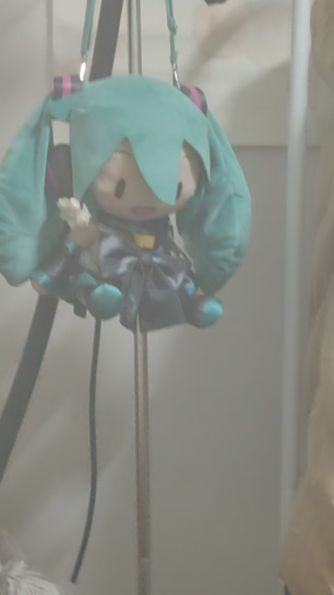
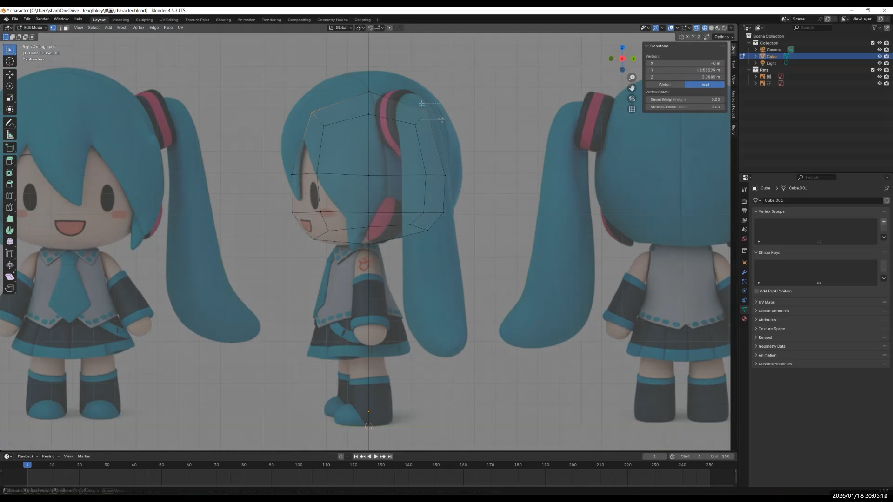

### Preparation Before Starting

**Step 0: Create a dedicated project folder (highly recommended)**  

- `refs/` for reference images (product photos, AI-generated orthographic views, style references)  
- `blend/` for Blender project files (named with version numbers)  
- `renders/` for final renders and process screenshots  
- `video/` for exported test videos / GIFs  

There are already some Fufu models available online, but I still wanted to make an original one—mainly to avoid copyright issues.

In the future, I plan to build a Fufu teahouse in VR, where cute Fufu characters will work as servers.

My main reference comes from the Fufu plush doll hanging by my window. It cannot stand on its own, but some plush toys use internal armatures to support standing poses. So in theory, this design should be feasible.

I also searched for product photos on shopping websites (a small modeling tip). It’s a very quick way to find references with the right proportions and feel—super convenient.

Then I used AI to make the character stand upright.

After that, I asked the AI to generate orthographic views.

The result was quite good, but unfortunately the head size was inconsistent between the front and side views, and the camera angle was slightly misaligned.

If I were to do this again, I would first fix these issues in Photoshop. That would make the modeling process much smoother.

---

### Importing Reference Images into Blender

- `Shift + A → Image → Reference`  
- Place the front and side views separately  
- Adjust their positions so that:  
  - The feet rest on the same ground line  
  - The head height matches across views  

This prevents reference images from interfering with later modeling steps.

Next chapter: Modeling!