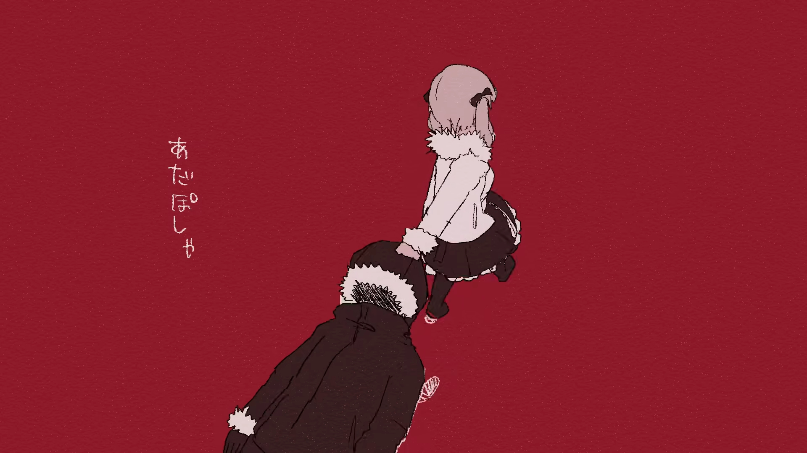

# [Fufu Modeling & Animation 1]Project Background

> A record of a modeling process that was not perfect, but very real  
> Tools: Blender  
> Keywords: character modeling / rigging / weight painting / toon shading (3D-to-2D) / Eevee

As a hand-drawn animation fan, I have always wanted to make my own animated piece. Recently, I listened to the song *Corpse Wax* and was deeply moved by it.

(Is it true that listening to depressing songs can give you stomach problems? My stomach has been acting up lately…)

So I created this hand-drawn animation for Fufu, with the background paying homage to *Corpse Wax*.

I wanted the character to feel doll-like—soft, cute, and cartoony—while keeping the background and camera work more “serious”: richer textures and more visual layers. This contrast helps the overall image feel more like a music video or a fashion film.

Because of that, I experimented with a stylized toon-shading (3D-to-2D) look.

I watched a lot of MMD works. Most of them focus on high-quality 3D production, with detailed models and impressive motion data. There are many ready-made, flashy animations, but not everyone enjoys mainstream choreography.

Personally, I prefer the feeling of frame-by-frame animation. So this time, I chose a chibi-style character to give the work a more artistic tone.

Next, let’s take a look at how the model was built.

