Modeling in Blender is actually quite simple. Let’s take a look together.

As the saying goes, “everything starts from a cube.”  
First, press **Shift + A** to add a cube. Then press **Ctrl + 1** to add one level of subdivision, and apply the modifier. This gives us a quad-based sphere.

By adjusting the surrounding vertices, we can quickly get a basic head shape.

The head is usually divided into “three sections.” At the moment, we only have the upper and lower parts,  
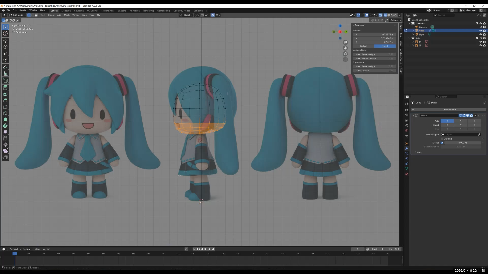  
so we can select the middle edge loop and press **Ctrl + B** to bevel it. This creates the three-section structure of the head.

Next, add another subdivision and apply it.

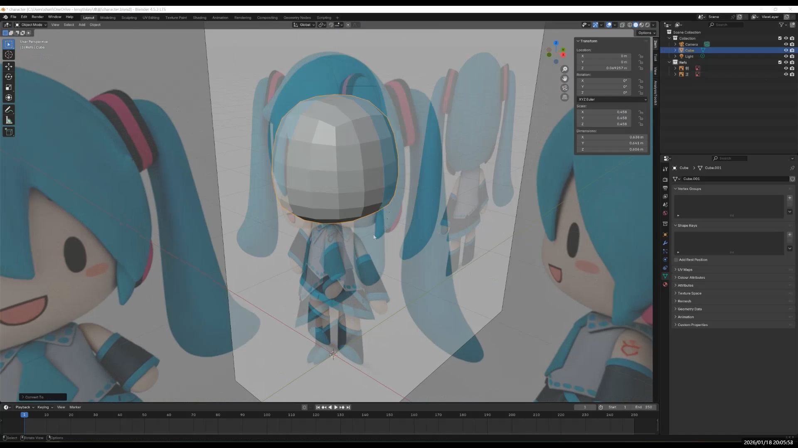

**Small tip: Mirror Modifier**

To make editing easier, switch to X-ray mode, select the vertices on the left half, and delete them. Then add a **Mirror Modifier** and enable “Show in Edit Mode.”

This way, since the model is symmetrical, you only need to edit one side and the other side will be mirrored automatically.

Go back to Object Mode, press **Ctrl + 2** to add two levels of subdivision, and right-click to choose **Shade Smooth**. The head will now look much smoother.

Make some small adjustments to make the shape cuter. At this point, the overall head shape is basically done.

I left the eyes for later—they’re the finishing touch, after all. I originally planned to use textures for facial expressions, but unfortunately I wasn’t able to make that work in the end.

Add the hair.

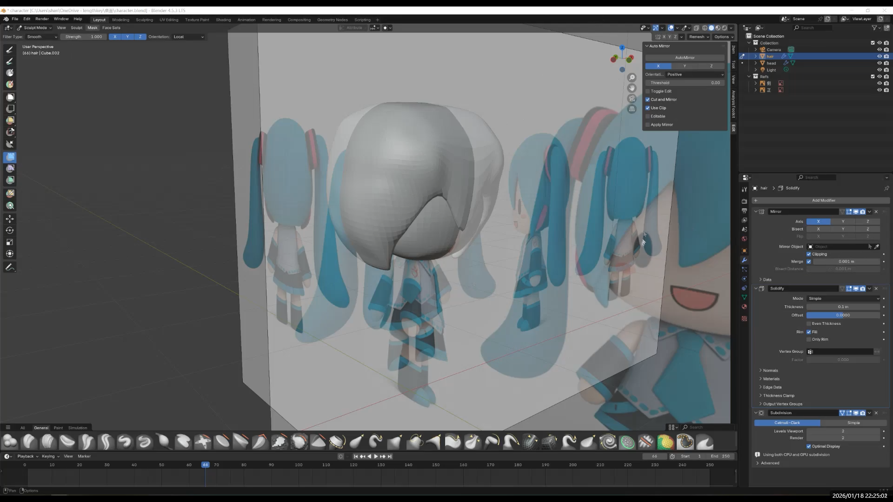

And twin ponytails made with curves!

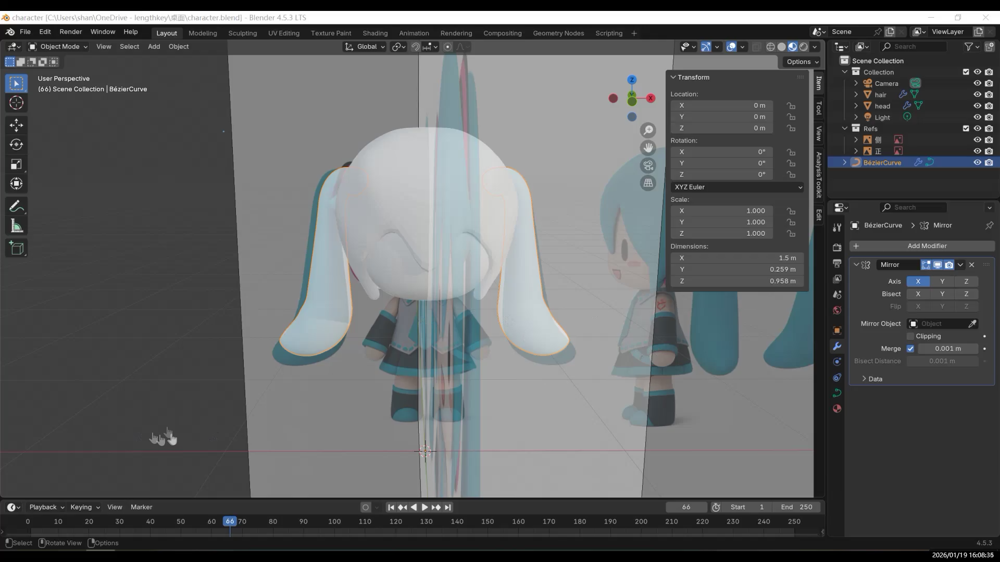

---

## Body

Press **Tab** to enter Edit Mode. Select the middle edge loop and press **Ctrl + B** to bevel it, dividing the body into upper, middle, and lower sections.

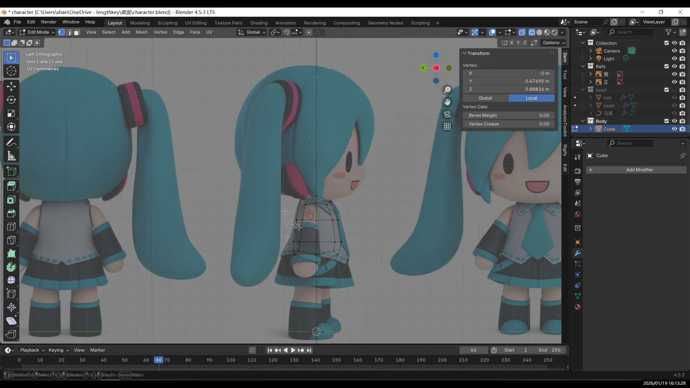

Adjust the scale and move it slightly upward so the three sections are more evenly distributed.

At the moment, the body looks a bit short, so scale it vertically to make it taller.

Then switch to the right view and push it slightly forward to roughly shape the back.

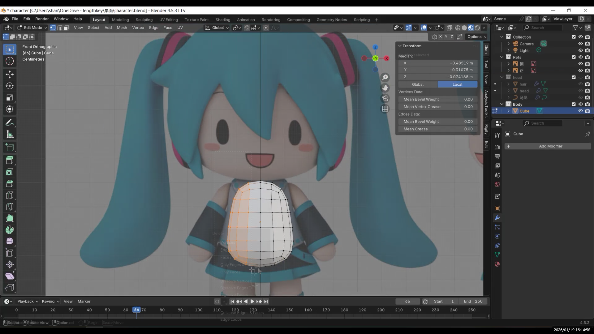

Next, add more geometry: press **Ctrl + 1** to add a subdivision and apply it. This gives you more room to refine the shape.

---

### Arms and A-Pose

Now let’s make the arms. Enter Edit Mode and find the four faces where the arms connect to the body. Right-click and choose the “Circle” option in the Loop tools (from the Loop add-on).

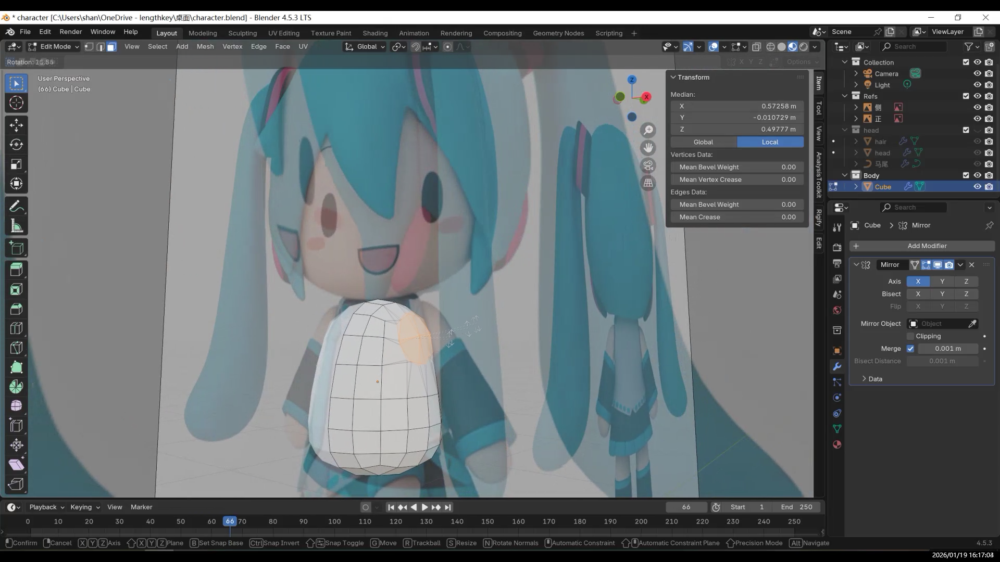

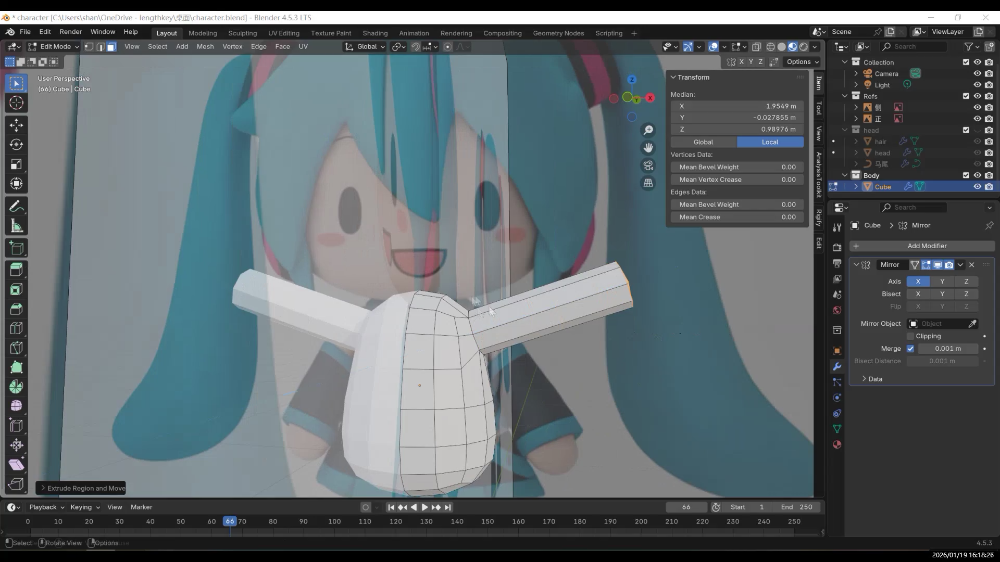

After extruding the arms, adjust the armpit area.

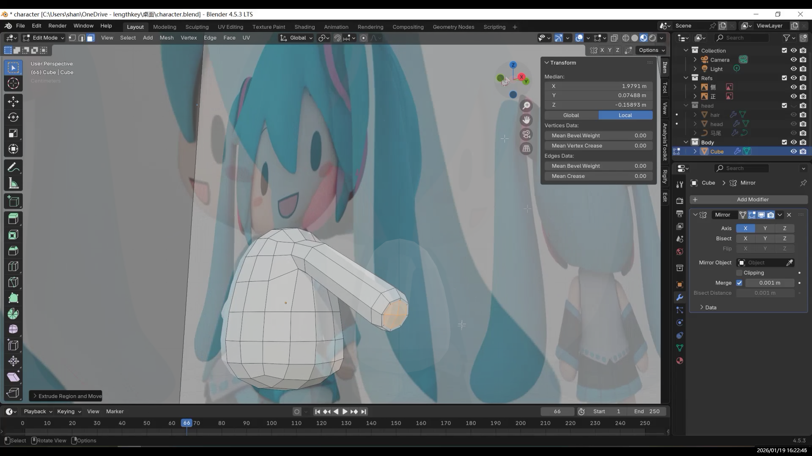

Add a **Mirror Modifier** and enable “Clipping / Merge” to reduce issues when editing along the center line.

---

### Legs and Feet

Next, move on to the legs. The process is similar. First, find the faces where the legs connect to the body. Be careful not to use the two faces next to the center line, or the legs may end up fused together.

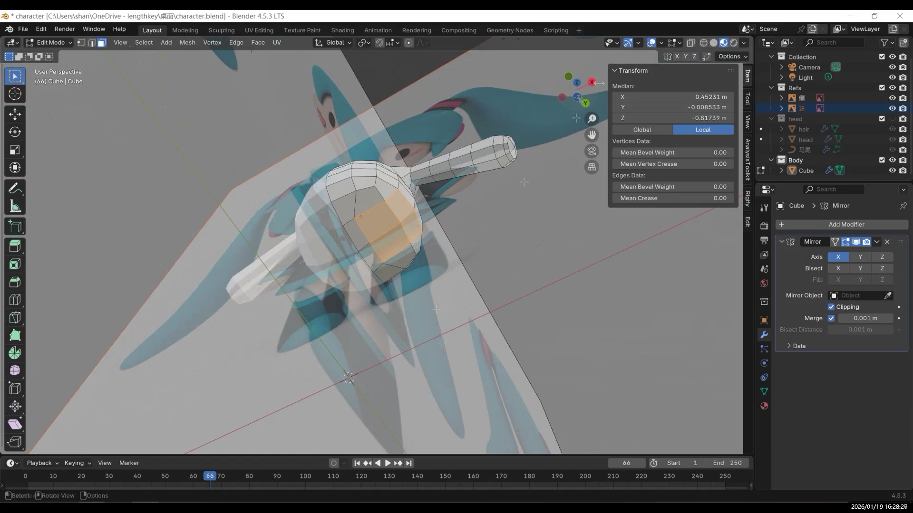

Select the four faces and press **E** to extrude downward, then adjust the shape so the legs naturally hang down.

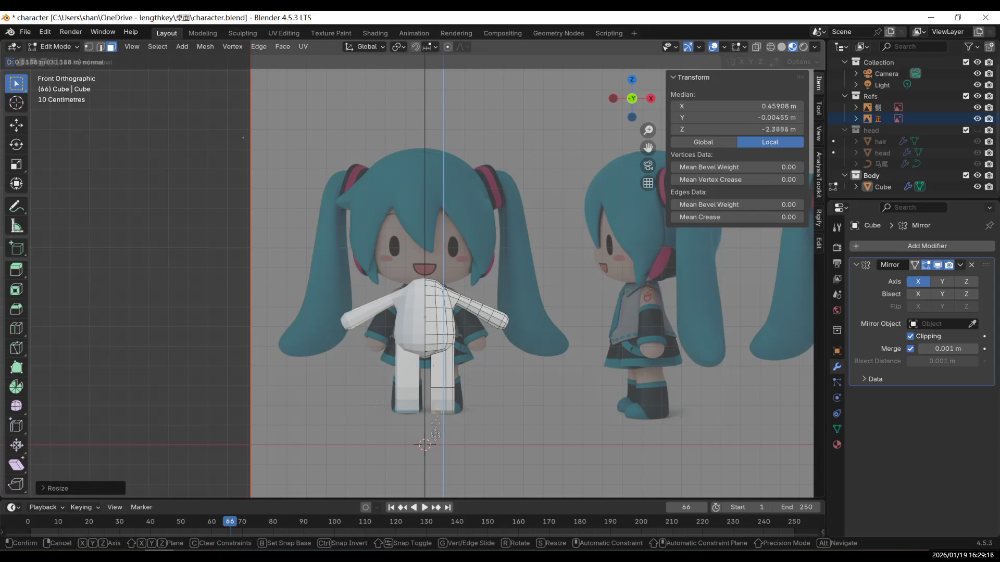

If the extrusion tilts, you can straighten it by scaling to zero along a specific axis.

For the leg shape, you can keep it simple and make it rounder.

Then move on to the feet: at the ankle, add a loop cut with **Ctrl + R**, then press **E** to extrude the foot. Add a few more loop cuts at the bottom to adjust the thickness and shape of the sole. Check the proportions from both the side and the front.

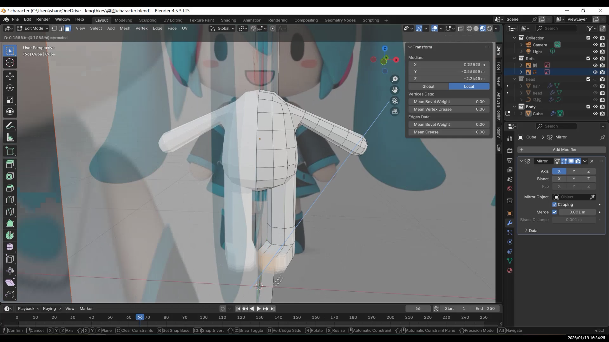

Add enough subdivisions to support the shape.

The neck is also very simple: select the faces above the shoulders,

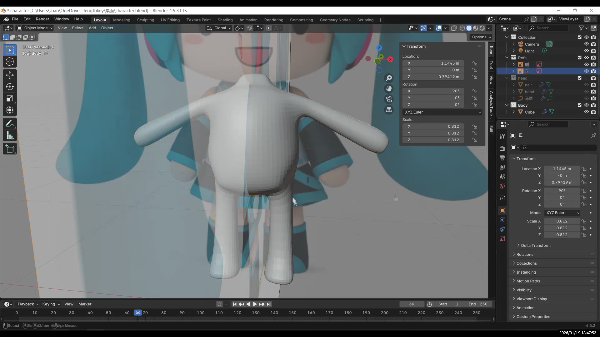

press **E** to extrude, then **S** to scale, and **G** to move it slightly backward.

At this point, the body is basically finished.

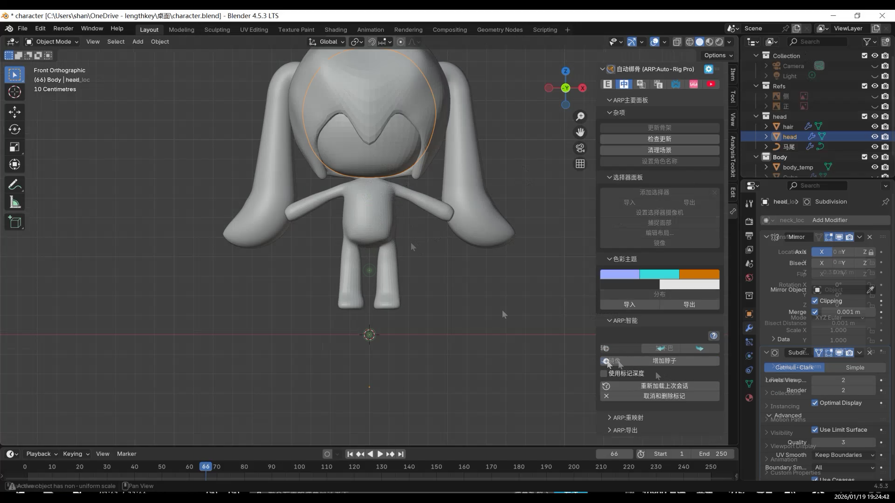
