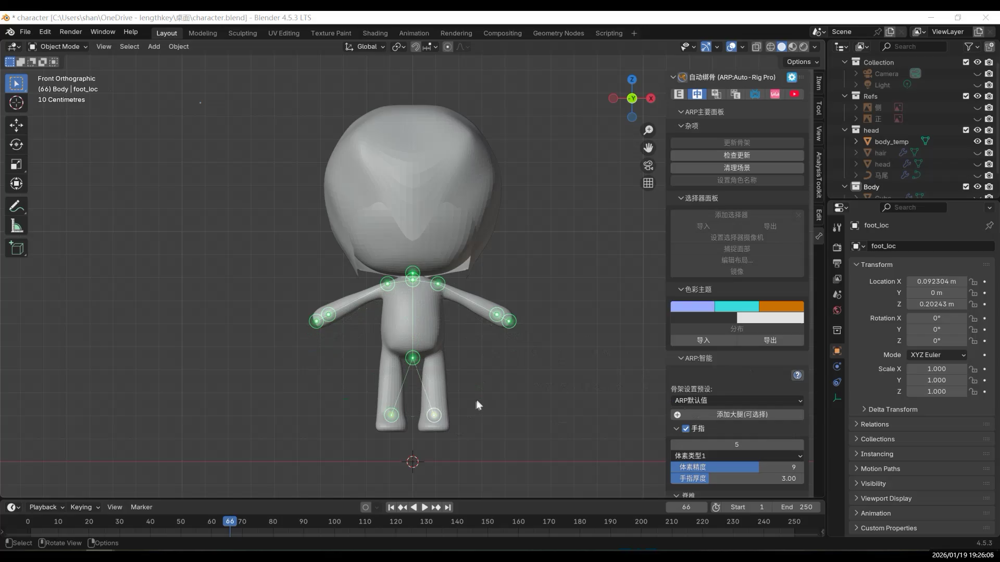
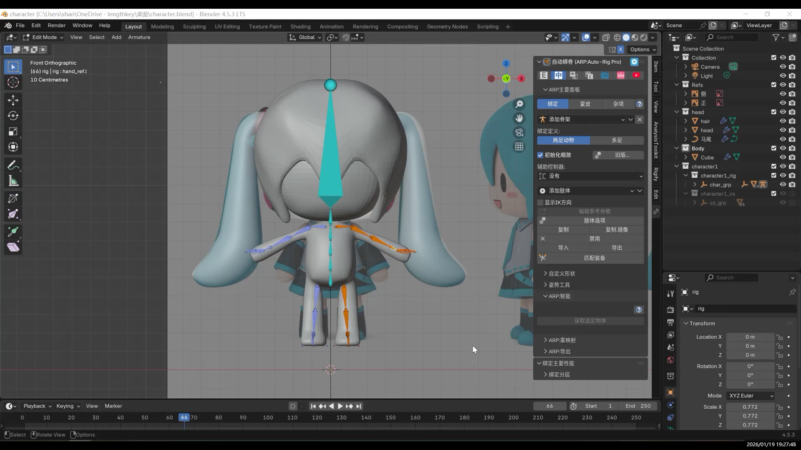
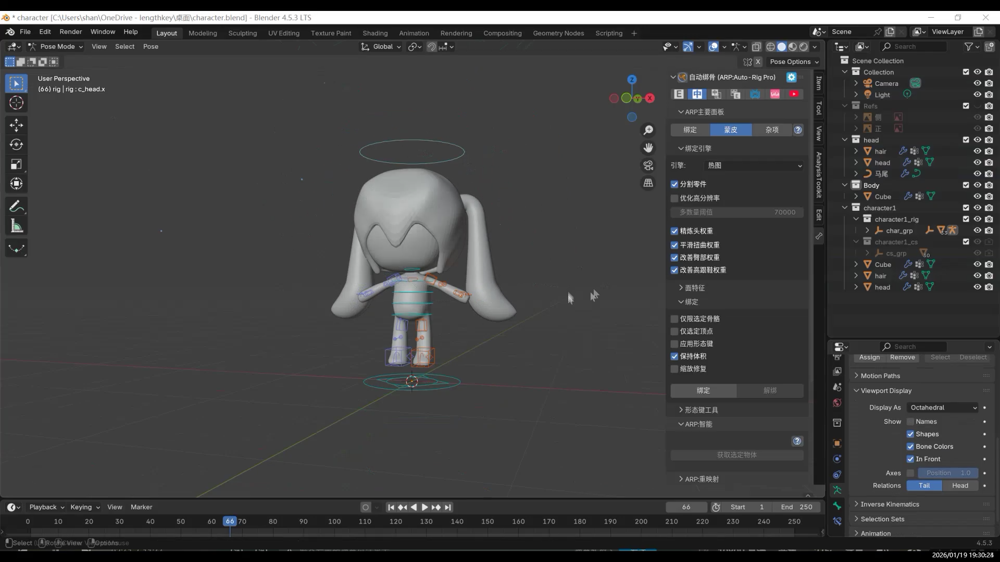
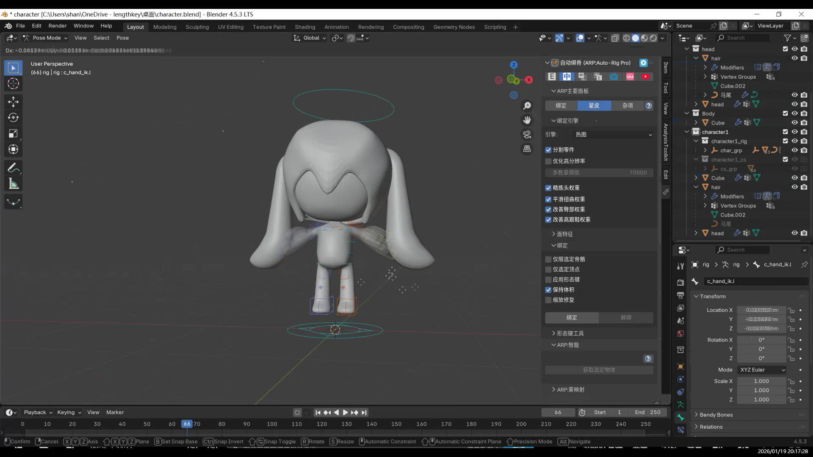
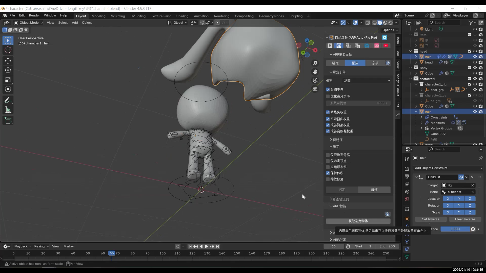
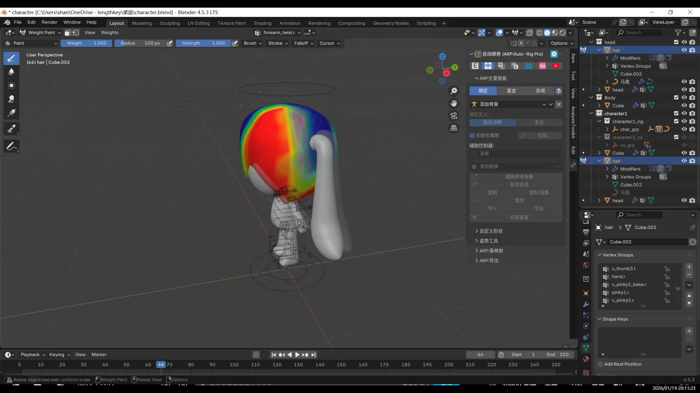

Open the character we created earlier — the version **without clothing**.

---

### Quickly Generating a Skeleton with Auto-Rig Pro

Place the markers (to define key skeletal points).

Auto-Rig Pro will automatically calculate and generate a skeleton based on the model, which saves a lot of manual work.

At this stage, the model is **not actually bound yet**.  
This step only generates the corresponding skeleton.

---

### Checking the Skeleton and Generating Controllers (Rig)

After the skeleton is generated, first check whether anything looks incorrect.

Click **“Match to Rig”**, and Auto-Rig Pro will generate a set of controllers that make the skeleton easier to manipulate (similar to a rig control system).  
Blender’s built-in tools can also generate controllers. The appearance is different, but the principle is essentially the same.

---

### Skin Binding (Bind)

Click the **Bind** button.

Switch to **Pose Mode**, move any controller, and you should see the character follow the movement.

> #### Tips
>
> Sometimes the controllers are “hidden inside” the model and hard to see.  
> Open the Pose panel, and under Viewport Display, enable **In Front**.  
> This makes all controllers clearly visible.
>
> You can also enable **X-Axis Mirror** in the top-right corner:  
> when you move the left wrist, the right wrist will move at the same time.

---

## Hair Not Following the Head: Solving It with Constraints

While testing poses, you may notice that the hair (for example, hair made with curves) does not follow the head movement.

In this case, you need to use a **constraint**.

After setting up the constraint, go back to Pose Mode and rotate the head controller.  
The hair will now move together with the head.

---

### Weight Painting

Switch from Object Mode to **Weight Paint Mode**.

Repaint the areas where the deformation looks incorrect.

> #### Tips: Smooth Tool for Softer Transitions
>
> If the overall weights are mostly fine but a joint transition looks too stiff, use the **Smooth** brush.  
> This helps soften the weight transition between two bones.
>
> In many cases, Smooth alone can fix most weight-related issues.
