### Two Ways to Make Clothes

When making clothes for a character, there are usually two approaches: **cloth simulation**, or **using meshes with weights**.

Cloth simulation can look very realistic, but it requires higher performance, takes a lot of time to tweak, and is not very beginner-friendly.  
So here I chose the more stable and widely used method: **mesh + weights**.

The biggest advantage of this method is that clothes are easy to control and modify. It also makes changing outfits later much easier.

---

### Copying the Body Mesh and Inheriting Weights

Before starting, open a character that has already been rigged and weighted.

As long as the body is correctly bound, when you copy part of the body mesh to create clothing, the **vertex weights are copied together**.  
In other words, the clothes “inherit” the body’s weights from the start.

This step helps avoid many common problems later, such as broken weights, bad deformation, or clipping. It is the most important part of the whole workflow.

---

### Top

To make the top, select the area of the body mesh where the clothing should be.

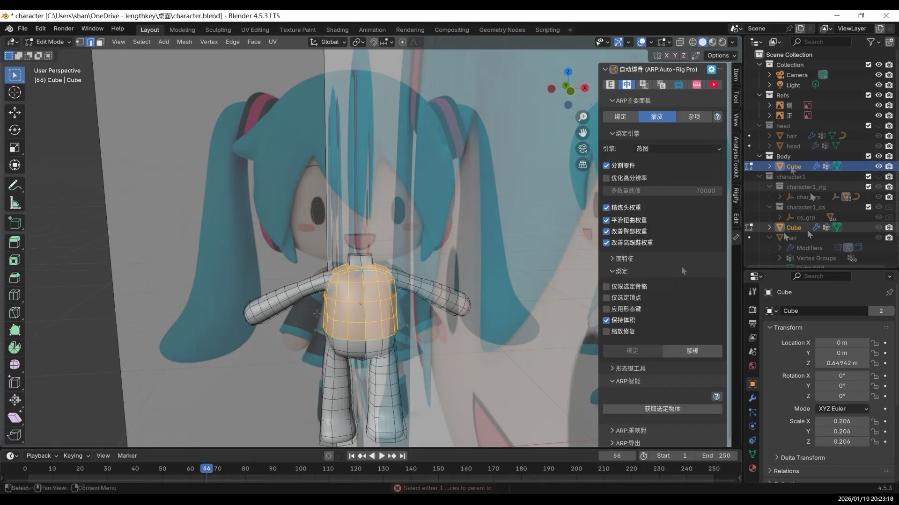

Use the “select inner region of loop” method to select the entire clothing area at once.  
After getting a clean clothing selection, duplicate it and separate it from the body. This creates an independent clothing mesh.

Enter Edit Mode on the clothing mesh, select all, and scale slightly along the normal direction to push the clothes outward.  
This helps avoid surface overlap and shading issues with the body.

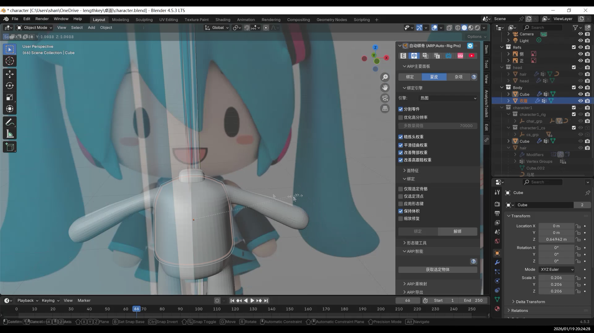

If you want the clothes to have thickness, add a **Solidify Modifier**.

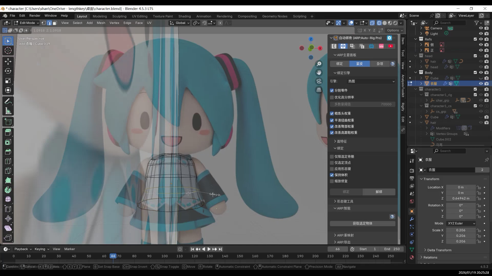

From here, you can start adding shape details to the clothing.

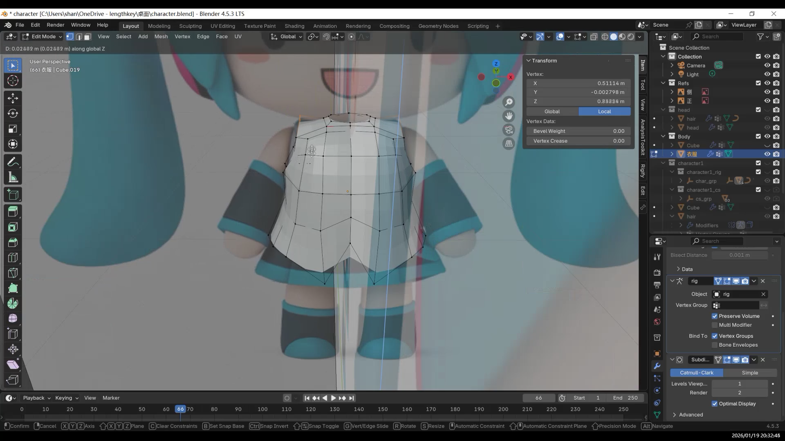

---

## Skirt / Pants

The method for making pants or a skirt is almost the same as for the top.

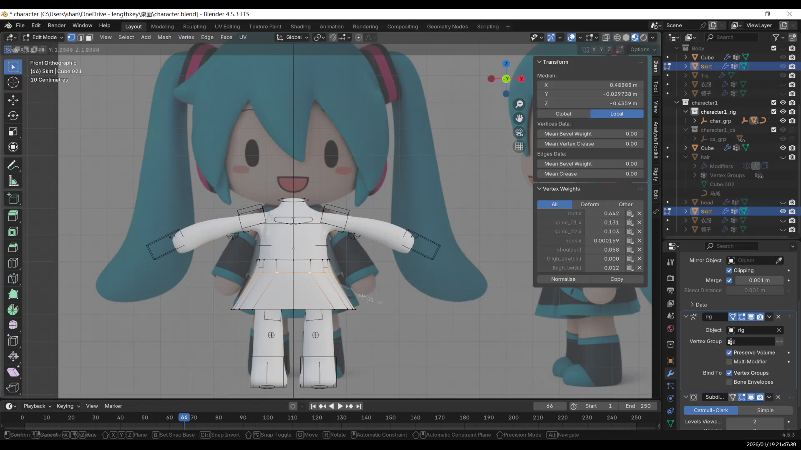

Sleeves are done in a similar way.

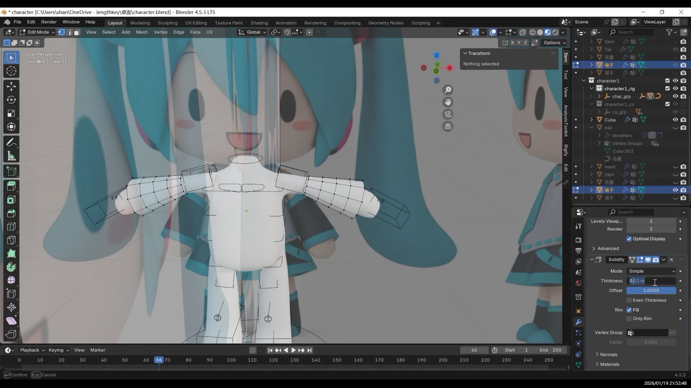

Add some bevels to soften the edges.

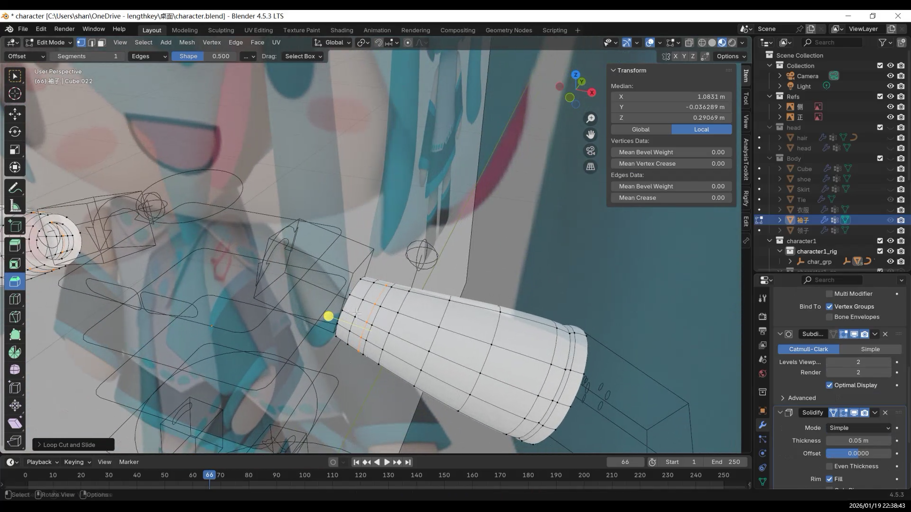

Shoes are also made using the same idea.

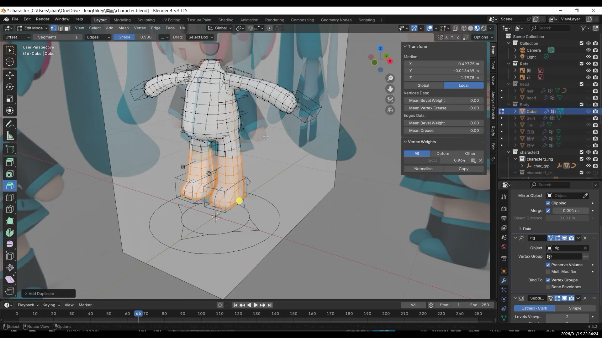

---

### Small Details and Constraints

Small decorations on clothes, such as buttons or zipper pulls, can be made by copying small parts of the clothing mesh.

If you don’t want these details to deform too much during animation, you can use **constraints**.

Here, I made a tie.

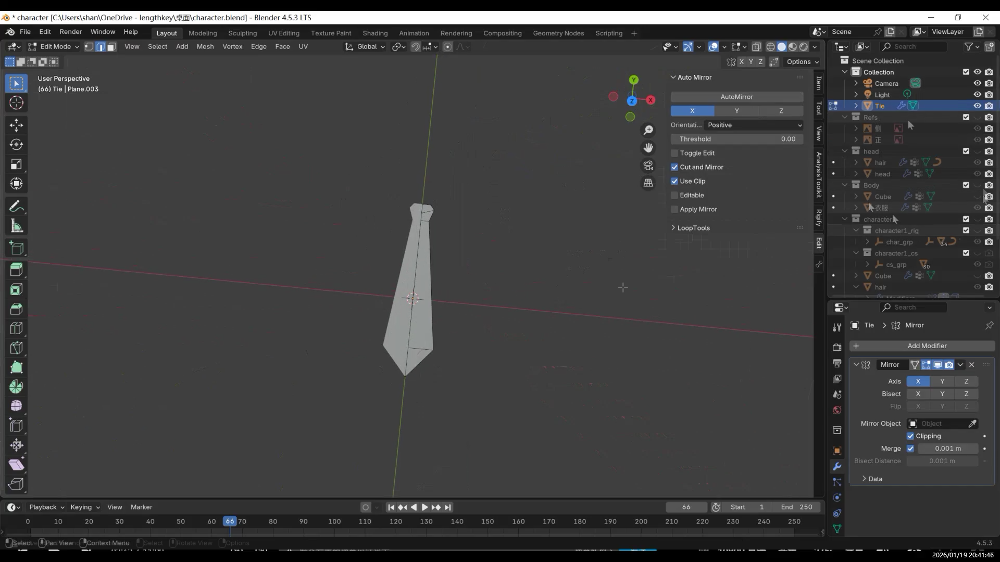

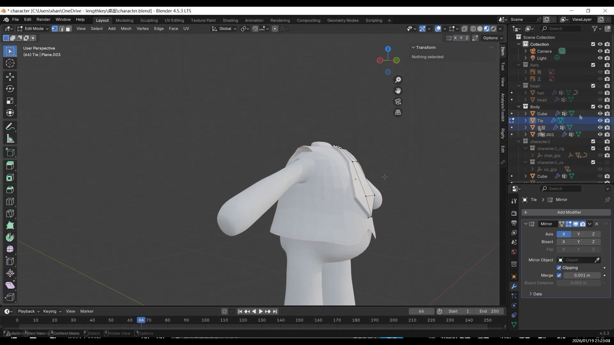

---

### Final Result

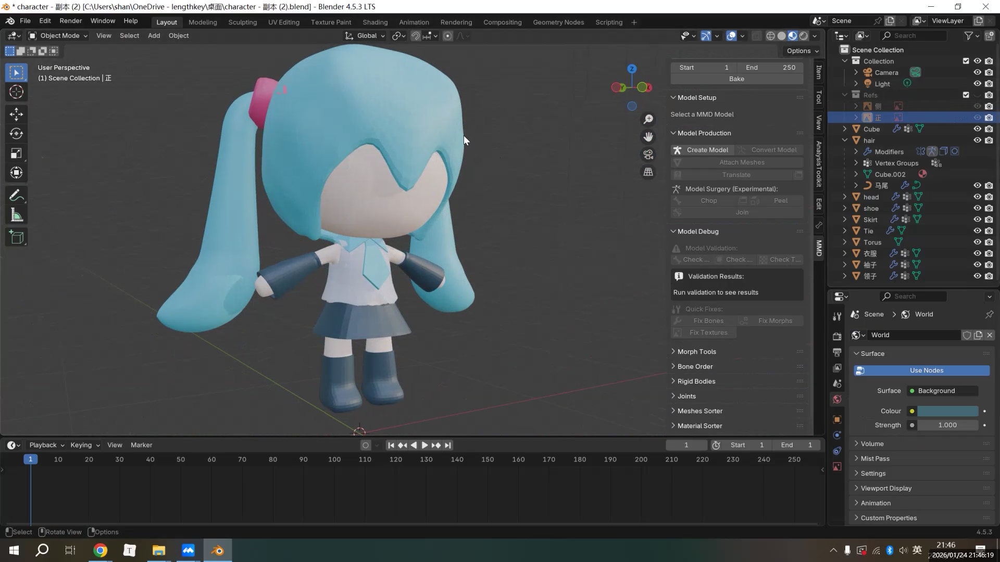

The biggest advantage of this mesh-copy-with-weights method is how much time and effort it saves.

Because the clothes start with the same weights as the body, they follow the character naturally in Pose Mode, with very few problems.  
For beginners, this means less time fixing weights and less risk of clipping when the character moves.

Since each piece of clothing is an independent mesh, you can also switch between different outfits quickly using collections.  
This makes the method very suitable for outfit changes and multiple design variations.