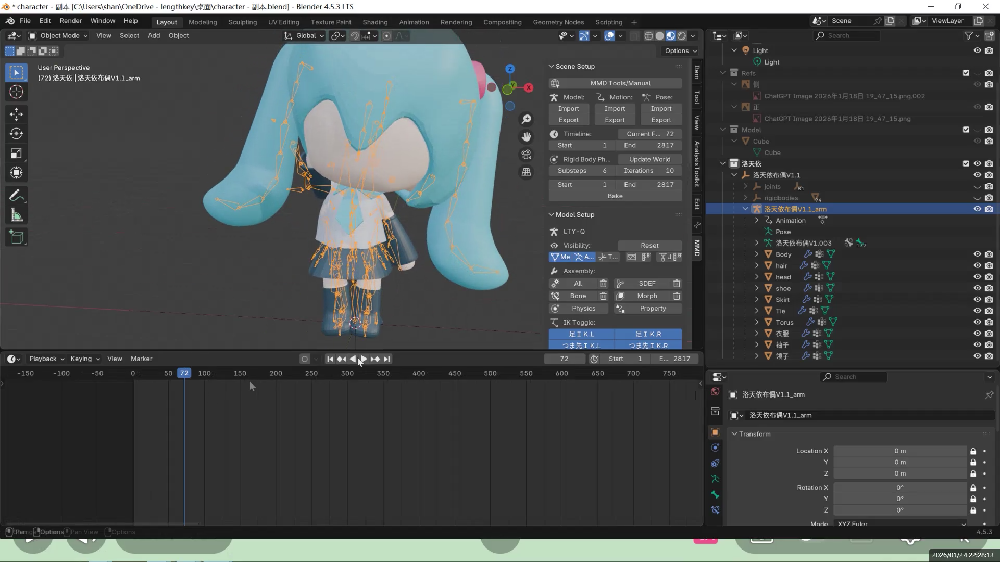
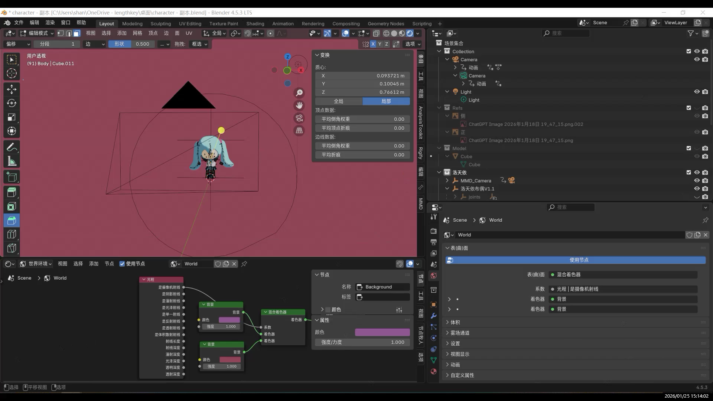
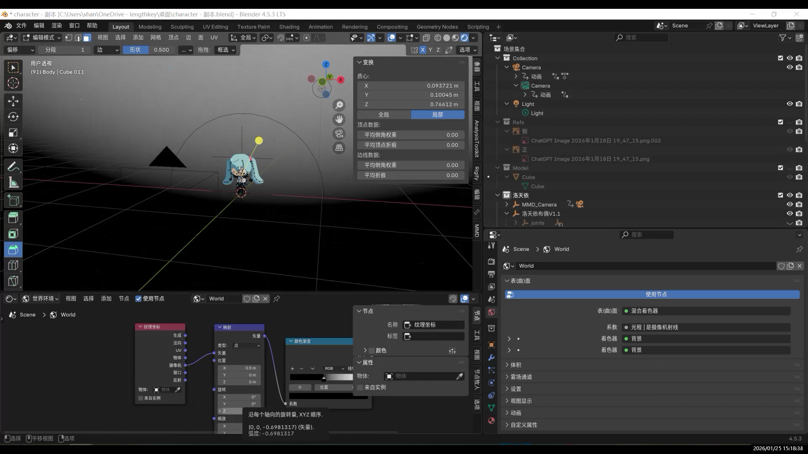
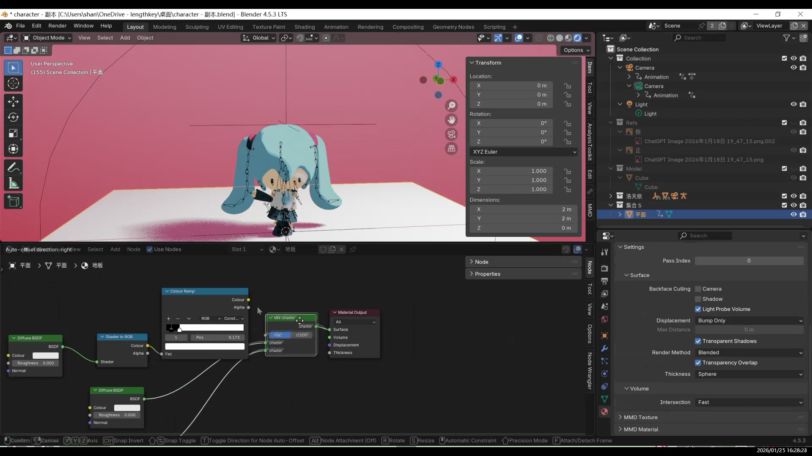
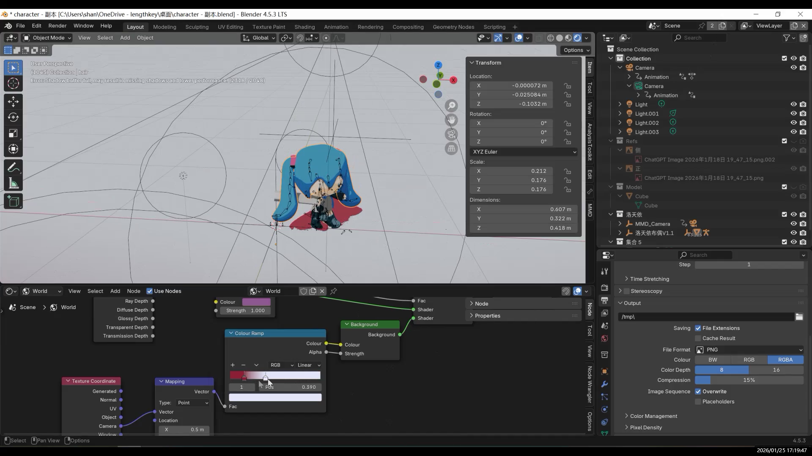
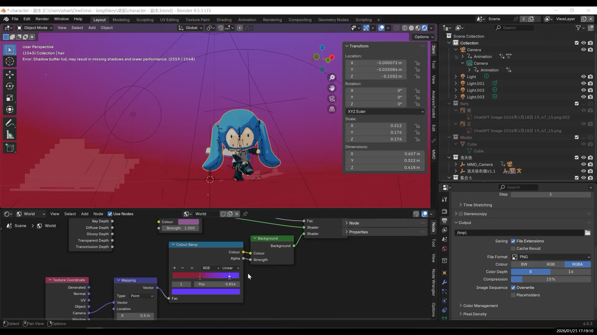
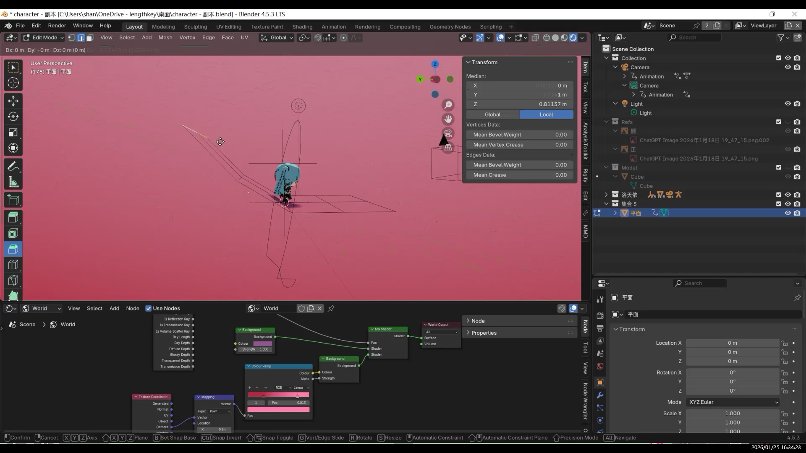
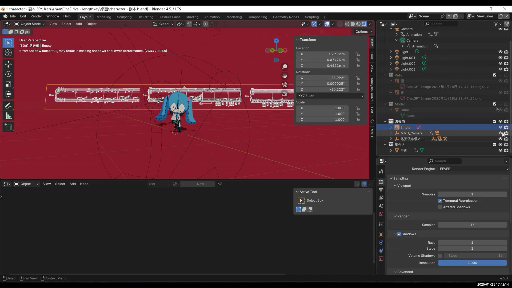
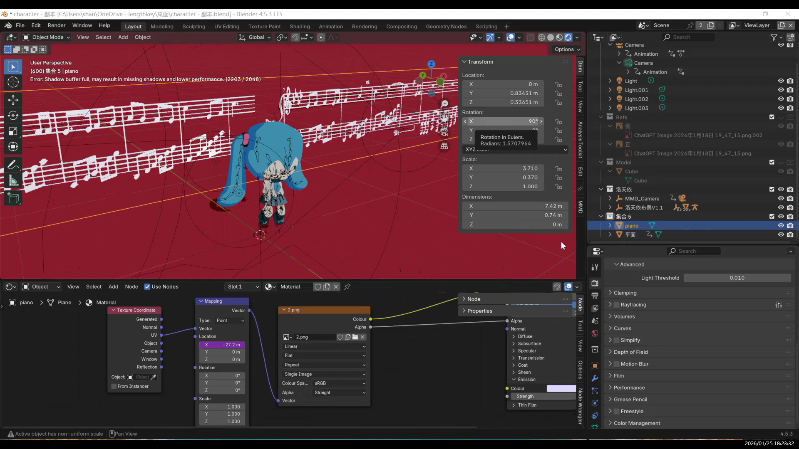

This project was rendered directly using **Eevee**.

- Eevee renders very fast, making it suitable for repeatedly adjusting materials and animation  
- It is especially friendly for cartoon and stylized rendering  
- Lighting results are intuitive, which makes iteration efficient  

For a 3D-to-2D (toon) style, realistic physically based lighting is not essential,  
so Eevee is a more suitable choice.

---

### Material Preview

### Initial Render

---

## Overall Idea of Toon (3D-to-2D) Materials

The character material uses a **three-level color control** approach:

- Base Color  
- Shadow Color  
- Highlight Color  

The key idea here is:  
**the light–shadow relationship of the character is not entirely determined by lighting, but mainly controlled by the material itself.**

This ensures that the character’s colors do not “shift” under different lighting conditions,  
keeping the style consistent and the image stable.

The material node setup itself is not very complex.  
ColorRamp or Mix nodes are used to split the shading into distinct steps,  
with shadow and highlight colors assigned explicitly.

---

## Background Material

Simply changing the camera background can work,  
but it lacks a gradient.

---

### Infinite Background

In animation or camera-movement shots, the traditional approach is to place a very large plane as the background and ground, then scale or bend it to keep edges out of view.  
However, once the camera moves or changes angle, edges, seams, or the horizon line are almost impossible to hide, resulting in visible “breaks” in the illusion.

Therefore, the core goal of an **infinite background** is not to make the plane larger,  
but to ensure that **the camera never sees the boundary of the background**,  
while still preserving the original lighting and shadow relationships.

The infinite background is implemented in the **World** shader nodes.

Adjusting the gradient position:

---

## Ground Contact: Shadows

At this stage, shadows are missing, and the character does not feel grounded.

Adding a visible plane breaks the background illusion.

For the ground, using a **Shadow Catcher** allows the ground itself to remain invisible while still receiving shadows.  
This avoids the “floating” look of the character.

Stylized shadows:

Final look:

---

## Lighting Setup

In a toon-style workflow, lighting is not used to sculpt form,  
but to **assist the material in determining light and shadow regions**.

Only a small number of lights are used (one or two key lights),  
with the character lit at a 45-degree Rembrandt-style angle.

Because the character has no nose, the effect is subtle.

Two spotlights are used to illuminate the background.

---

## Camera Movement

The camera movement was inspired by other creators’ dance-oriented camera work.

---

## Musical Staff Animation

The musical staff animation is created by moving UVs in the shader nodes using a simple formula.

---

## Final Result

---

## Conclusion

If I continue refining this model, I will mainly focus on two directions:  
first, further organizing the rig and weight structure to improve stability during large movements.

The next step is to try importing the model into VR and testing different rig systems.  
If conditions allow, I also hope to turn it into a usable **VRChat character**.