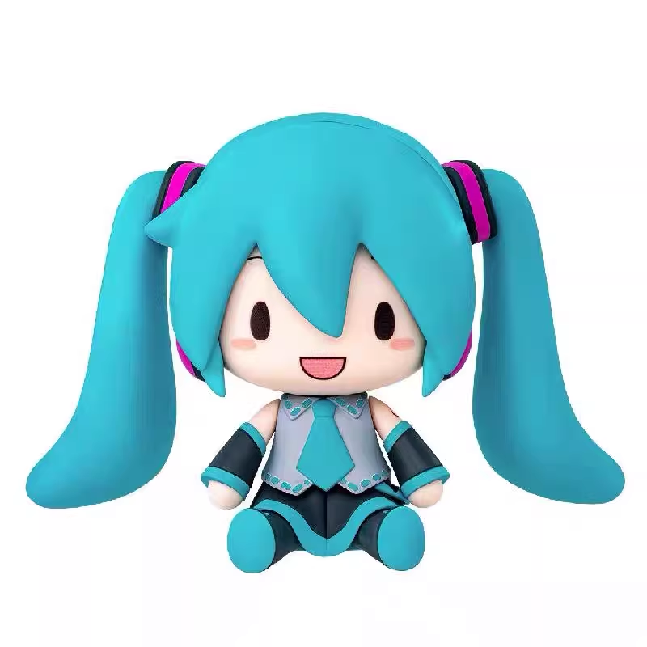
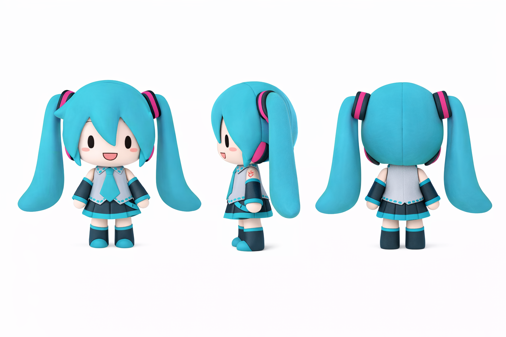

### 开工前的准备

**Step 0：建一个专门的工程文件夹（强烈建议）**  

- `refs/` 放参考图（产品图、AI三视图、风格参考）  
- `blend/` 放工程文件（版本号命名）  
- `renders/` 放最终渲染和过程截图  
- `video/` 放导出的测试视频/GIF  

网络上其实已经有一些 fufu 的建模了，但我还是想做一个原创的，主要是为了规避版权的问题。

日后我计划做一个VR里面的fufu茶社！店里是可爱的fufu服务生。

我的参考来自一直挂在我窗前的 fufu 玩偶，她是无法站立的，但是也有给棉花里加入骨架来使他们站立的。所以理论上是可行的。

我找了购物网站上的产品图（建模小技巧），你可以很快的选到感觉合适的！是不是很方便

然后用 AI 让它站起来。

再让ai出三视图

效果很好，可惜正面和侧面的头大小不一致  并且视角有些偏移，

如果在做一次，我会 ps 调整后再来。建模都会顺很多。

### 把参考图放进 Blender

- `Shift + A → Image → Reference`  
- 分别放正面、侧面图  
- 调整位置，让它们：  
  - 脚踩在同一条地面线上  
  - 头顶高度一致  

这样后面建模时不会干扰操作。

下一章：建模！