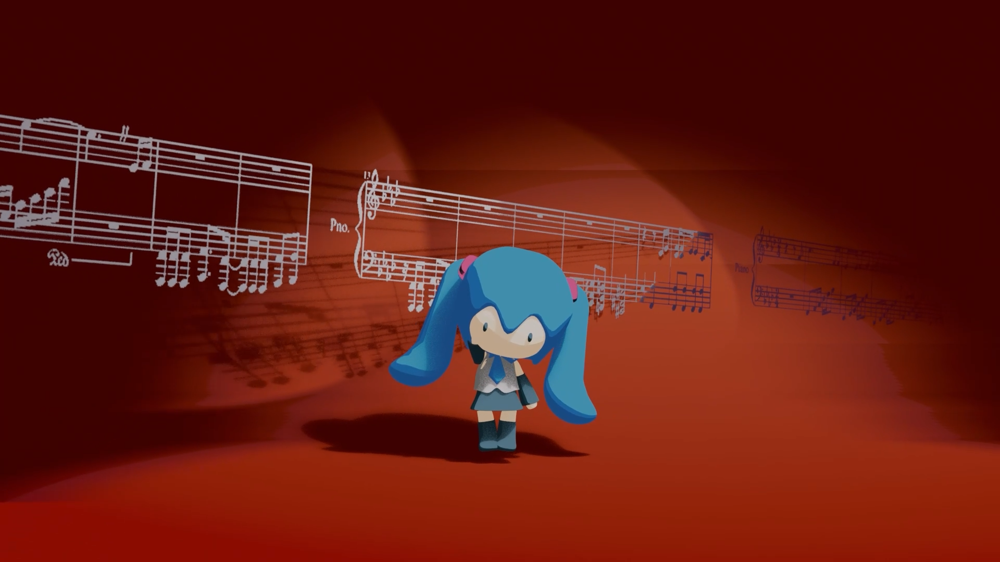
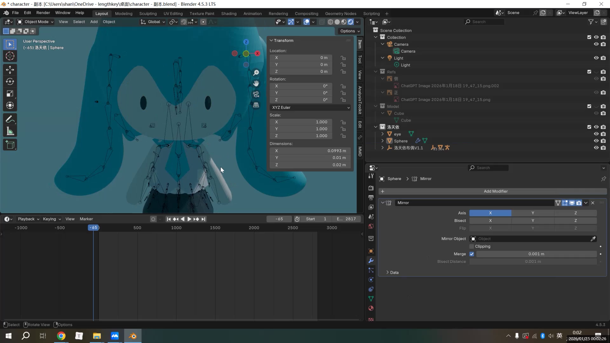
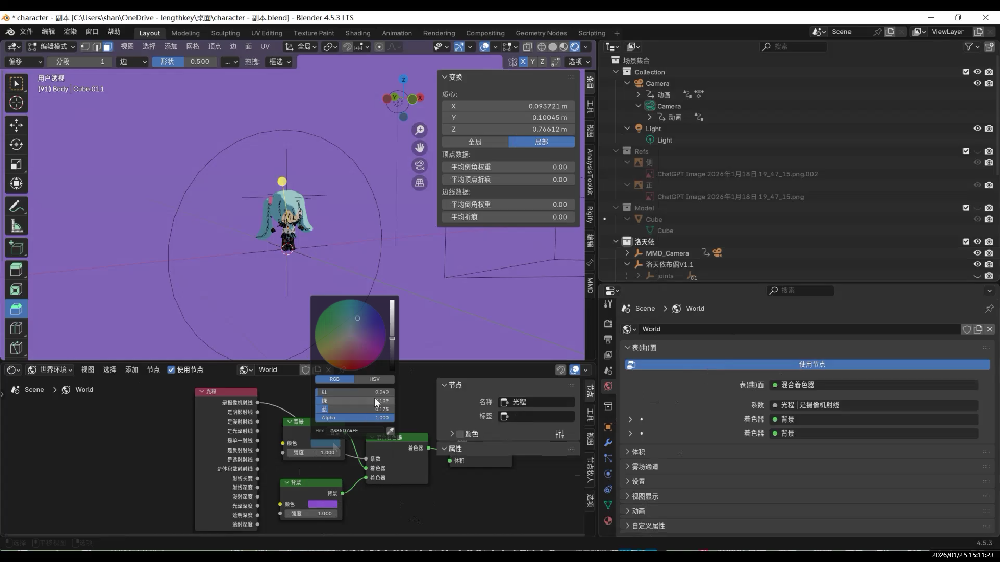
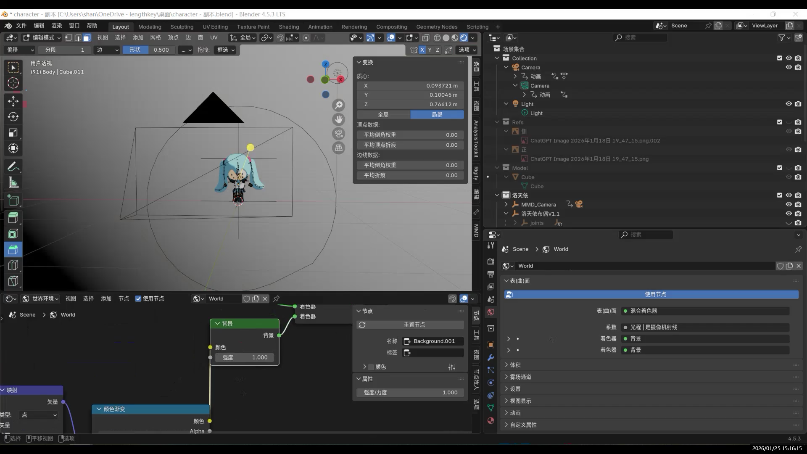
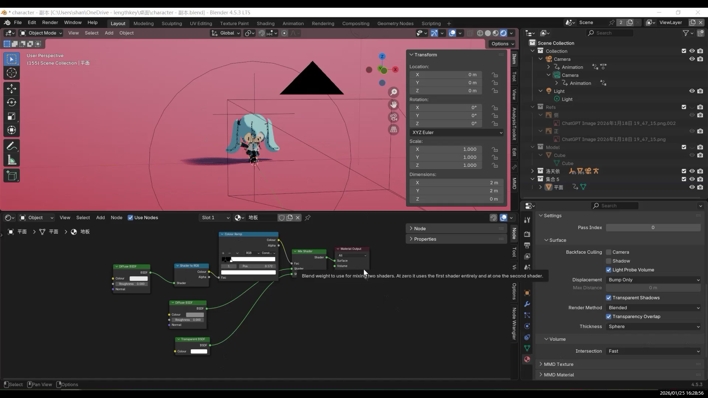
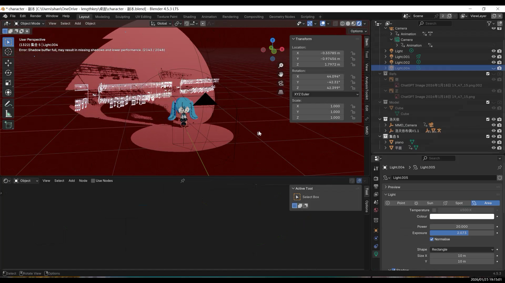

本次渲染直接使用 Eevee。

- Eevee 渲染速度快，适合反复调试材质和动画  
- 对卡通 / 风格化渲染非常友好  
- 灯光结果直观，调整效率高  

对于三渲二风格来说，并不依赖真实物理光照，  因此 Eevee 更合适。

材质预览：

初步渲染：

### 三渲二材质的整体思路

角色材质采用的是**三层色阶控制**的方式：

- 基础色（Base Color）  
- 阴影色（Shadow Color）  
- 高光色（Highlight Color）  

这里的关键点在于：  
**角色的明暗关系不完全交给灯光决定，而是由材质本身控制。**

这样不同灯光条件下，角色颜色不会“跑偏”  风格统一，画面稳定 

材质节点整体结构并不复杂，使用 ColorRamp 或 Mix 节点切分色阶  分别指定阴影色和高光色  

### 背景材质

更换相机背景就可以达到，但是缺少渐变

#### 无限背景

在动画或运镜场景中，传统做法通常是放一个很大的平面作为背景和地面，通过拉高、拉宽来避免边缘入镜。但只要相机发生移动或角度变化，背景的边缘、转折线或地平线几乎不可避免地会暴露出来，形成“穿帮”。因此，“无限背景”的核心目标并不是把平面做得更大，而是让**相机永远看不到背景的边界**，同时又不破坏原本的光照与阴影关系。

无限背景的在 World（世界环境）节点中完成。

调整渐变位置

### 落地细节：阴影

但是现在缺了阴影，人物不够立体

添加平面又打断了背景

在地面处理上，使用 Shadow Catcher 可以让地面本身不可见，但依然接住物体的阴影，从而避免“物体漂浮”的问题。

风格化阴影

最终效果

---

### 灯光设置

在三渲二风格中，灯光的作用不是“塑形”，  而是**辅助材质判断明暗区域**。

使用少量灯光（ 1–2 盏主光）  ，人物斜45度伦勃朗光。

因为没有鼻子所以看不出来

两站聚光灯打量背景

---

### 五、运镜设计：

参考了别人的镜头设计，舞蹈运镜。

### 五线谱动画

在节点对uv使用了公式进行移动

---

最终效果

## 结语

之后如果继续优化这个模型，主要会集中在两个方向：  
一是进一步整理骨骼和权重结构，让角色在大动作下更稳定；  

下一步的计划是尝试把模型导入 VR，测试不同的骨骼系统，  
如果条件允许，也希望能把它做成一个可用的 VRChat 角色。

