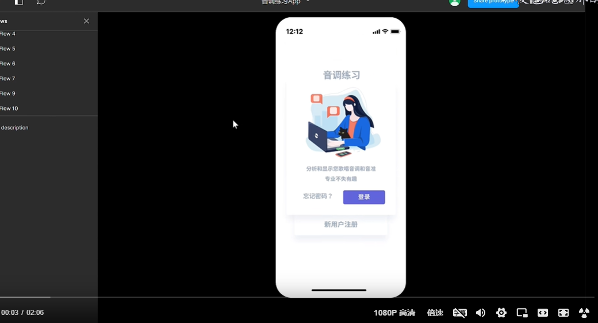
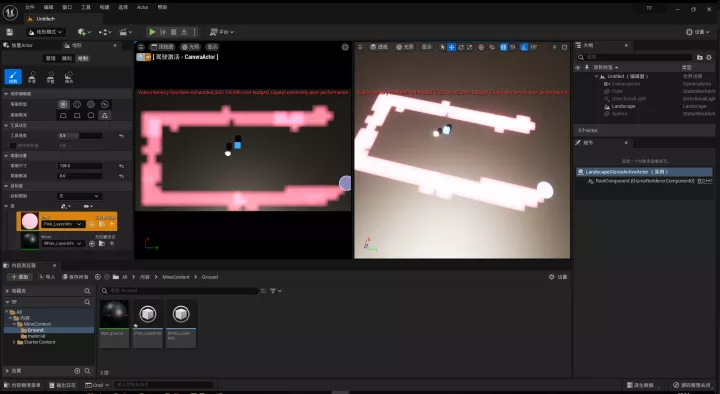
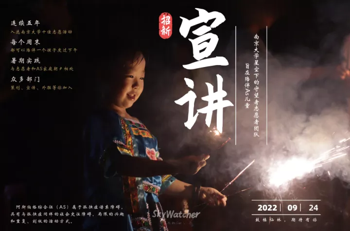
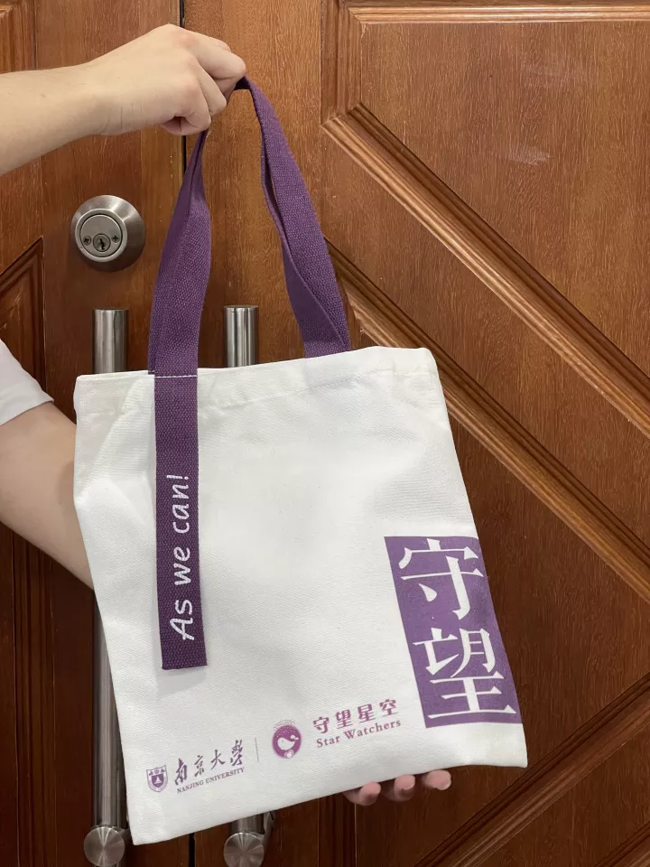
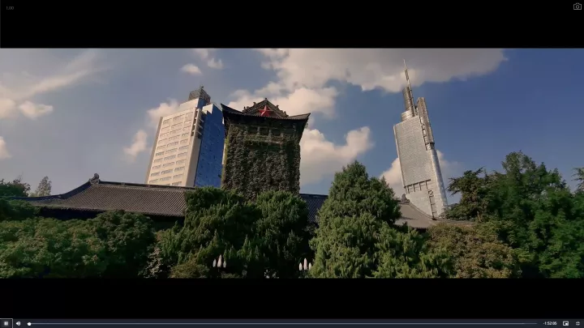
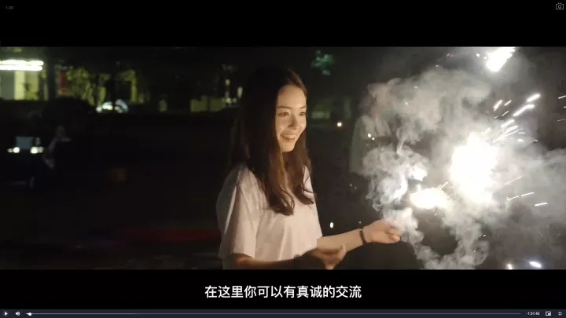
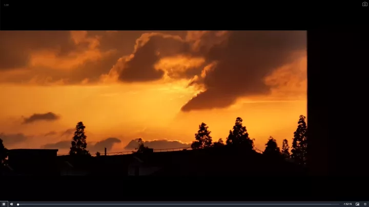
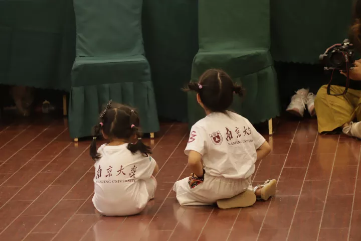

### 原型设计

“音高练习App”。本人主要负责高保真原型图的制作，秉承以用户为中心的思想，使用Figma，参考外网资源实现

视频链接：【音调练习app】 https://www.bilibili.com/video/BV1GR4y1k7yB/?share_source=copy_web&vd_source=a835c0479f1ae10e33e10aa2fa40f07e

项目链接：https://www.figma.com/files/project/60202484/Team-project?fuid=1123575408744607384

<iframe src="//player.bilibili.com/player.html?aid=348791664&bvid=BV1GR4y1k7yB&cid=924646769&page=1" scrolling="no" border="0" frameborder="no" framespacing="0" allowfullscreen="true" width="100%"> </iframe>
### 游戏设计

使用Qt平台开发的PC端交互游戏，VR塔防游戏，

项目链接：【自制游戏 校长模拟器】 https://www.bilibili.com/video/BV1Bx4y1M7W1/?share_source=copy_web&vd_source=a835c0479f1ae10e33e10aa2fa40f07e

### 个人网站

基于Hexo框架，在githubio布置了个人网站。从样式表，html架构等方面对White主题框架进行了拓展，加入了自己的设计思考。
项目链接：https://shannju.github.io/

### 海报作品

为南京大学星空下的守望者志愿活动制作
图片版权所有

### 周边设计

为南京大学星空下的守望者志愿活动制作

### 视频制作

协调20人团队制作时长120min纪录片，以及人物访谈两篇
纪录片链接如下： https://box.nju.edu.cn/f/c368f19feab14b149321/
因保护孩子隐私原因，恳请不要发布或外传

视频截图：

### 摄影作品

本网站使用图片均为个人摄制

#### 策划展览

南京大学“草木”线上摄影展览
参与摄影作品《十九岁》
展览链接：https://mp.weixin.qq.com/s/N71Kp9QoXf4V8Q3v64PkMg

南京大学致敬大先生系列展之“走进戴安邦”编委
参与文物图片设置与排版
展会报导：https://mp.weixin.qq.com/s/d2EK5XPyBYnqGL6EszrYBQ