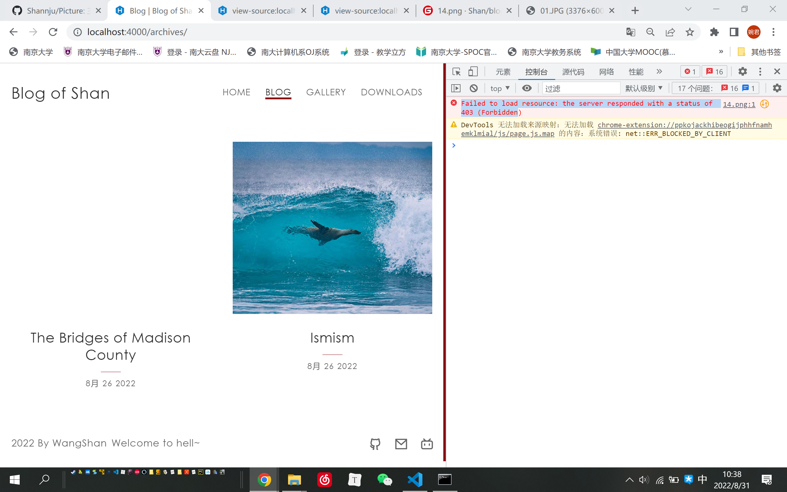
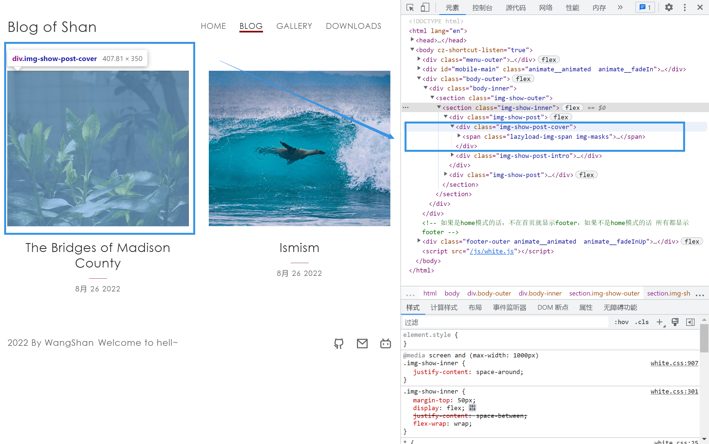
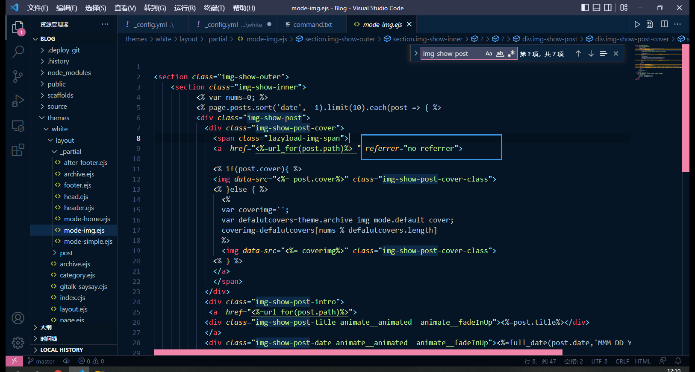

# 个人网页请求图片403---不要用Gitee做图床

这是我搭建个人网站遇到的头几个bug，那就一边de，一边吹。在一个满是bug的博客里看debug教程，是不是有点一边开车一边换轮子的乐趣（

搭博客的教程参考的cu大师。傻瓜教程，非常细腻，推！https://blog.cuijiacai.com/blog-building/

然后个人做了个低配版本：HEXO框架 + Git Page（可包揽服务器域名等等一切麻烦事，只要会add commit push和科学上网就可以做，缺点是访问慢）

### bug

bug：Hexo框架搭建网站，自己的图片无法显示，主题自带的就可以。



所以不是不能显示，是请求不到，浏览器F12开控制台看看，报错403

**Failed to load resource: the server responded with a status of 403** 

### 速通--if你的图床是gitee

不要用Gitee做图床 不要用Gitee做图床 不要用Gitee做图床

如果您的图片存在gitee，可以试试换个地方（比如github）gitee大量屏蔽外链，所以出现了403 资源不可用。

我只是图一个国内访问快，没想到在这栽了。

### 主流解决方案--if 你的debug.time==0

如果你的问题不在此，我分享一下我浏览的记录。

百度一下，给出的解决方案多是：

> 解决方案：利用html中的meta标签关闭浏览器的UrlReferer访问
>
> ```ruby
> themes/next(主题)/layout/_partials/head/head.njk
> ```
>
> 在里面的<head></head>中添加下面代码即可
>
> ```xml
> <meta name="referrer" content="no-referrer"/>
> ```

就是在模板的head部分关掉referrer（引用源），这样生成的每个网页head里面都包含这一句。不告诉服务器图片出处。 原理如下：

> 图片服务器通过检测 Referrer 是否来自规定域名，来进行防盗链。如果没有设置referrer，那就可以直接绕过防盗链机制，直接使用或盗取。 
>
> --- 参考https://segmentfault.com/a/1190000017896469

但是我试了并不可，或许head是关了，但是我的图在body里面

### 进一步解决 if 你已经在互联网de了一圈

那就找找主题模板的body在哪里。

菜鸡还是浏览器看，定位到这里。



在主题模板里翻翻，

```
Blog\themes\white\layout\_partial\mode-img.ejs
```

可以在此找到 对应的`div class="img-show-post-cover"`

我试图在a标签里面加了ref设置成no-referrer，img href也可以加这个。



完全的好了，网站可以放自己的照片了呢！

