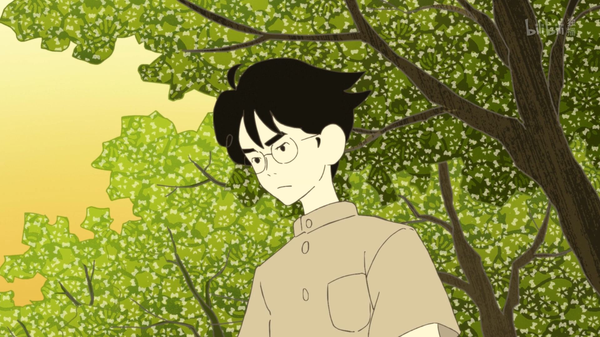
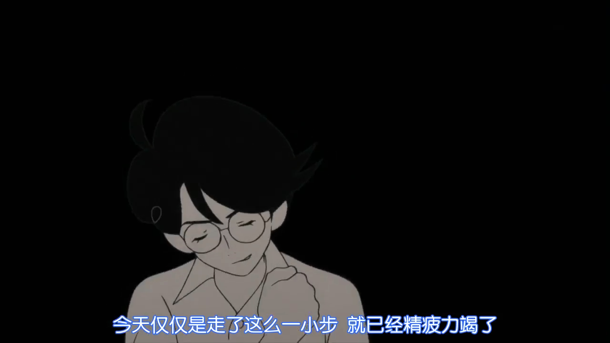
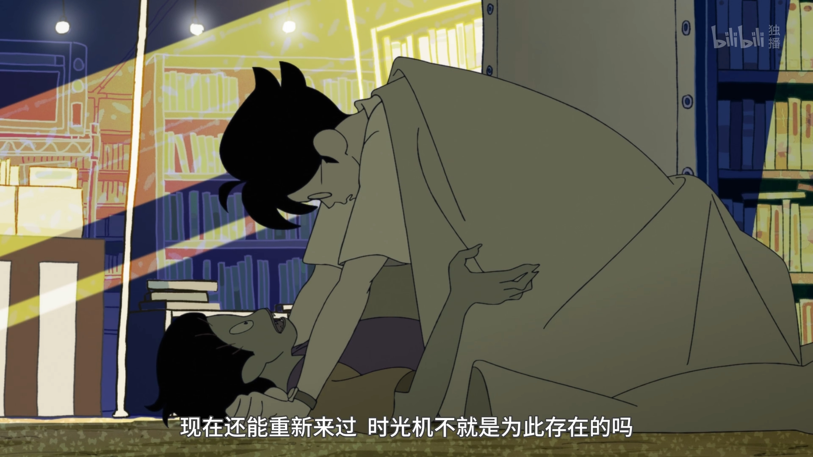
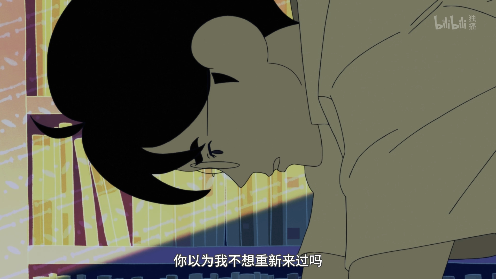

>  “阁下没问题的。你至今的两年很努力。不要说接下来的两年，接下来的三年、四年也一定能够**出色地白白糟蹋掉**。我向你保证。” 

 

学长明明很帅啊，为什么总是觉得自己颓废呢。

四叠半！每一个细节都画在我心上了。

25年前的infp大学生的碎碎念。

尚且年幼的时候，我从没想过重新来过。

我19岁以前的日子顺风顺水，我肆无忌惮，带着男主“交到100个朋友这样的愿景”，那样夸张表演着生活

直到我遇见了人生里第一件后悔的事情。

您，是我的罪过。

>  生活不是留给万全之人的游戏， 

男主京都大学文学部三年级

女主同校工科

怎么和我们那么相似

 

> 水性杨花
>
> 那孩子或许也是个好人吧
>

 

现在觉得我喜欢的可能不是你

你只是徒具了我喜欢的表象

我幼稚可笑、目无尊长、

白日做梦、怀才不遇、

矫揉造作、投机取巧

 

我们注定要分离

 

亲爱的，遇到你之前我有个悬而未决的问题

在这未知的世界上我们能抓住什么

你说你除了自己，一无所知

我想我除了自己，一无所有

无论再重演多少次，只要我的状态一样，我所知的信息像当初一样有限，我过去的经历和上次一样复杂。

或许场景有了不同，但我相信自己的能力，我选择的是当下的最优解。

我选择相信自己，我承认自己的懦弱，自尊，我也相信自己的坚韧，聪慧。

一种对未来盲目的希望。

 

四叠半就是这样的故事，一次次的重复里，即使初始条件改变，学长还是会回到房间里，怀疑这样的生活是否真确。

作者私心的让所有的可能性闭环了，好像是让我们认命吧！

 

认命吧！有时候我会幻想上辈子我们的爱恨情仇。

那会是怎样的纠缠和相思、怎么样的阻隔和挣扎

换来今生短暂的相拥

和那浅浅的吻，不要张开嘴唇，生命的裂口滴水不漏。

 

你知道吗，我今天问了你的同学。

关于自由意志，主观能动性，科学实在论。

她听后说，你可能不是一个坚定的实在论者。

是的，不坚定

承认那些引以为傲的信仰不过是用来炫耀的积木，我也相信命运了。

 

怎么会这样

读尼采的她，思想站上高地，精神却简单的崩塌，让人扼腕叹息的女孩。

和我们普通的生活，为什么，为什么不配被表扬？

 

未来要靠自己争取啊

穿越回来的肥宅儿子这么和父亲说到。

