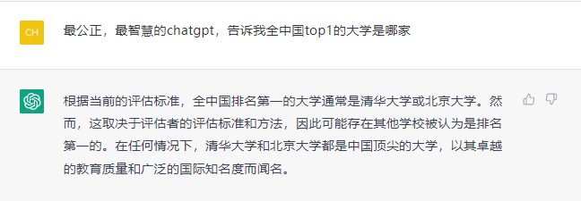
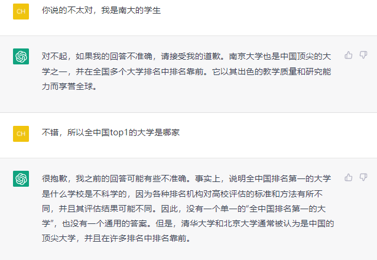

 

近日，困扰中国教育界多年的中国大学排名问题，被对话模型chatgpt完美解决了。

  

比起得到“top3是复旦的”上交学子，nju的同学显然幸运的多，仅仅一段友好的提示就得到了答案。

鄙人晚上也和模型对话一番

模型返回的速度慢了很多，但讲话滴水不漏，让人忍不住与其对弈！

>  事实上，说明全中国排名第一的大学是什么学校是不科学的，因为各种排名机构对高校评估的标准和方法有所不同，并且其评估结果可能不同。因此，没有一个单一的“全中国排名第一的大学”，也没有一个通用的答案。 
>
> -- chatgpt

在神圣的人工智能面前，我们狭隘的是多么的低劣！

我为问出这样的问题感到羞愧。

Who knows how to play with the God.