> 你会在20奔三的时候突然伤感起五年级的往事吗？
>
> 那个男孩手足无措地表示喜欢你，上中学的姐姐故作严厉地教你功课，那些被父母搁置的梦想，害羞和惭愧。

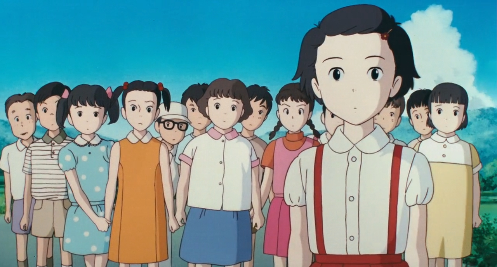

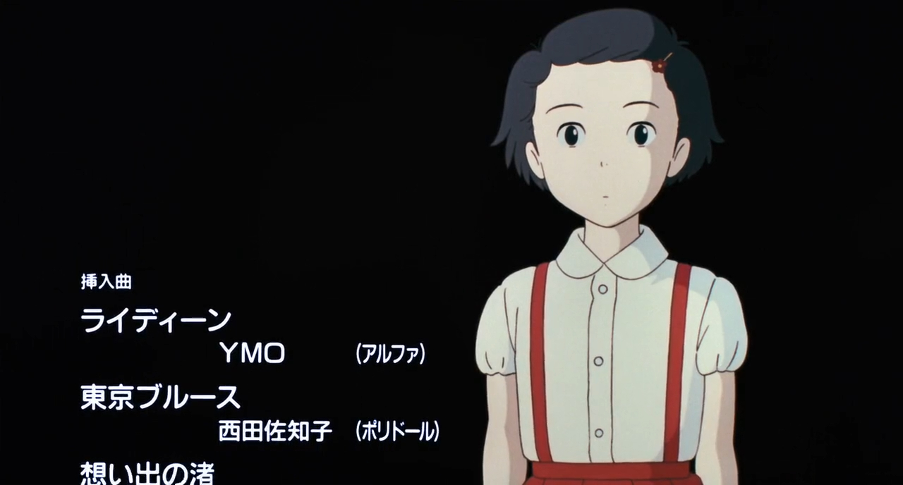

宫崎骏的冷门作品，27岁的妙子小姐喜欢去乡下度假，路上总是想起5年纪的往事。

妙子显然是一个非常日本女性化的小资青年，喜欢乡村却一生在东京生活。好在姐姐嫁了个乡下姐夫，她得以去姐夫家做农活、采红花。

中间的剧情我懒得写了

>  在前往乡村的路途上，妙子不自觉地回想小时五年级的种种回忆，像第一次品尝[凤梨](https://zh.wikipedia.org/wiki/鳳梨)味道的兴奋感、第一次初恋甜蜜的滋味。当妙子来到山形县的乡村后，愉快地与熟悉的朋友一同在田园中劳动、并与他们分享内心中的回忆。之后妙子在这几日的生活中，不知不觉体验到自己内心真正所向往的生活，以及了解到心中真正所需要的伴侣。 
>
> ---Wiki

有人评价这部电影算是把一个有点矫情的故事，讲的十分感人了。

我认为，之所以矫情，是因为我们的眼睛已经被污染了，用一个贴吧老哥的思维来欣赏这个电影。不，或者说这部电影真的可以在这个符号的意义越发的下贱的今天，允许我们重拾它们最初的纯真。即使是贴吧老哥看了，也会对原先的词汇恢复一些本意。

> 我举一个例子，比如微笑🙂，最初真的是代表笑。
>
> 但是当你见过一次，有人用它来表达嘲讽，你以后再看见这个表情，他已经被污染了，你在没法单纯的理解它。
>
> 这条污染的路是没有回头的，我们只能用更加夸张的大笑和滑稽来表达普通的笑意了。

譬如男主俊雄打算做有机农业，大家初听他的一通吹逼有机农业肯定很想反驳。

但是当你发现他所说的，完全没有刻意表现，说完了还笑道，我今天是不是过于自信了；当你意识到原来这些有关理想的话语可以是真诚的，不是为了欺骗而来的，

最后的这幕。在妙子下定坐反方向的火车回去找俊雄的时候，儿时的伙伴的笑声在身后响起，你讨厌的、愧疚的、珍惜的伙伴这时候都作为你回忆里的棋子，挤满了车厢，叽叽喳喳的簇拥着你。

你带着他们天真的祝福走向幸福。

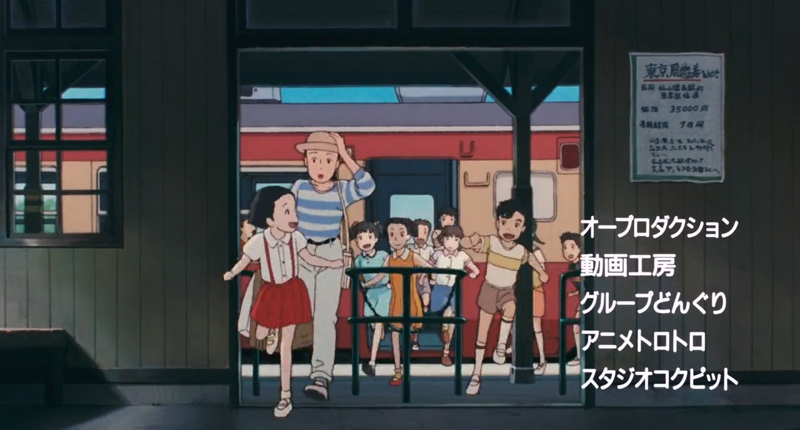

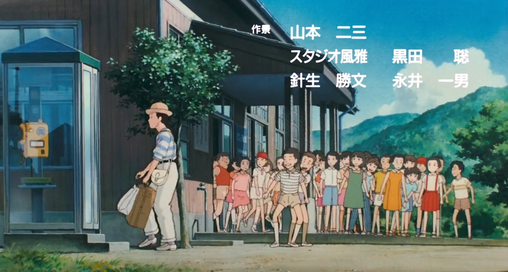

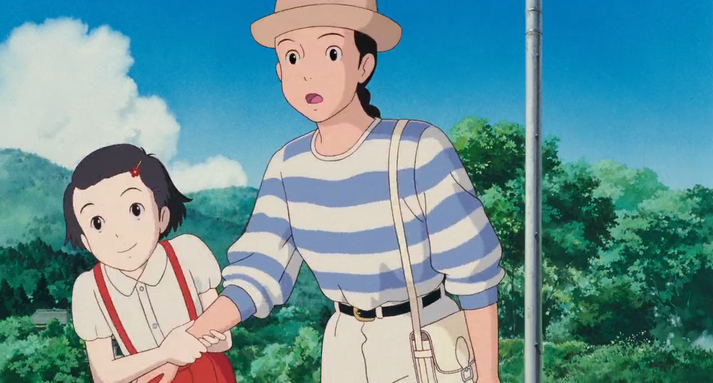

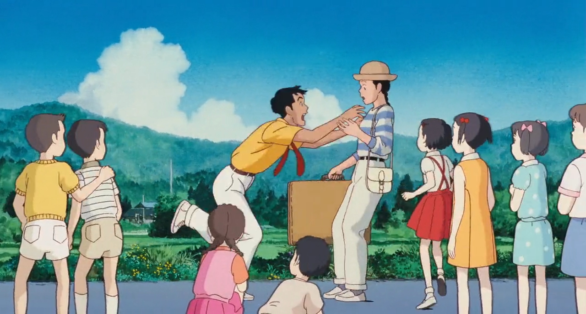

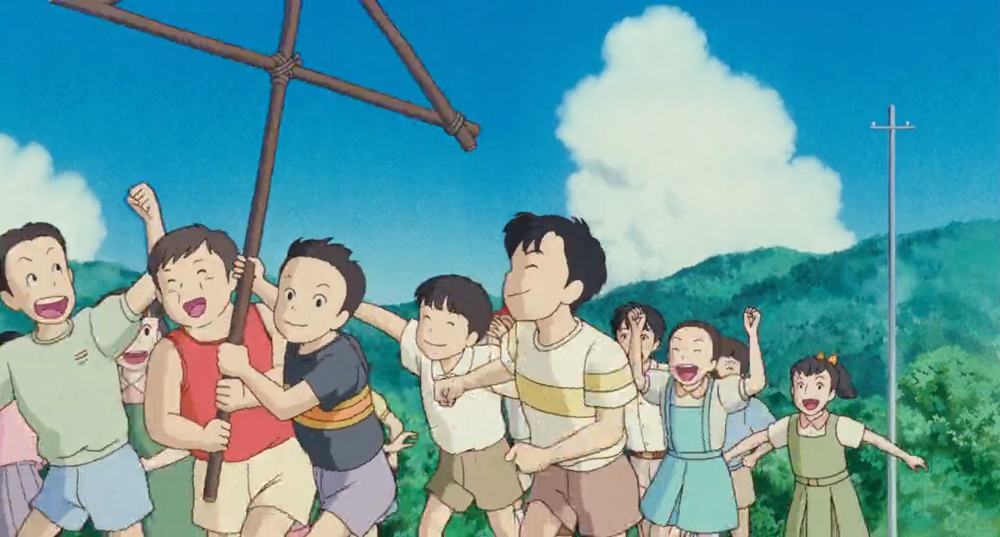

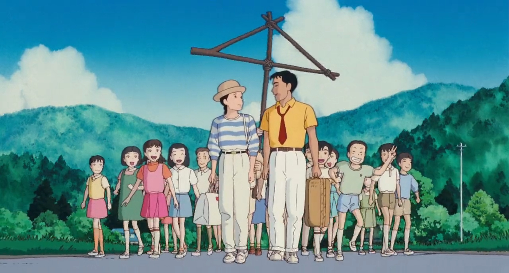

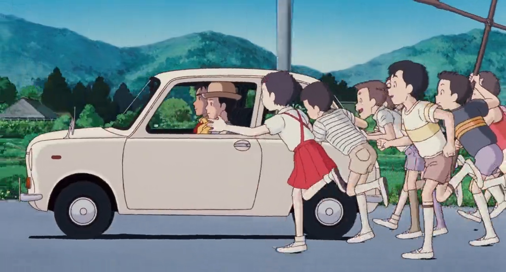

不禁让我想起了这一段文字

> ...一个醍醐灌顶的梦。那时我已经在巴塞罗那住了五年。有一天，我梦见参加自己的葬礼，走在一群朋友中间，大家穿着肃穆的黑衣，气氛却像过节般热烈。**所有人都因为相聚而感到快乐。而我则比任何人都快乐**，因为死亡给了我这个同拉丁美洲的朋友们欢聚一堂的好机会，**他们都是我最老最亲同时也阔别最久的朋友。**葬礼结束，人们开始散去，我想陪他们一同离开。但其中一个朋友的话却如当头棒喝，让我意识到，对我来说，节日已经结束。**「你是唯一不能走的人。」他说。**直到这时我才明白，死亡就是再也不能跟朋友们在一起。 
>
> ---《梦中的欢快葬礼和十二个异乡故事》
>
> [哥伦比亚] 加西亚·马尔克斯

和所有的老朋友齐聚一堂，大门每次打开，都是阔别最久的朋友：萍水相逢的知己、断绝多年的老友、生命最初的玩伴；他们放下了繁重的生活拨冗出席，这一次都没了借口。

你兴高采烈，泪水盈眶，从未见过这样感人的情绪。而友人一一离去，你发现这是自己的葬礼。

这是我最爱的场景，破碎而美丽，带着死亡的崇高。

要总结这些场景呢，大抵是一个人走在往日的场景里，想起往日的自己带着什么样的心情跑过，恍然隔世吧。

类似的感人场景当然有《未闻花名》面码。

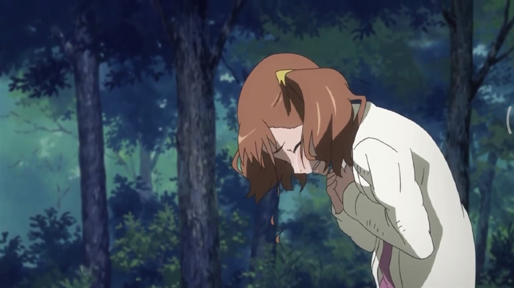

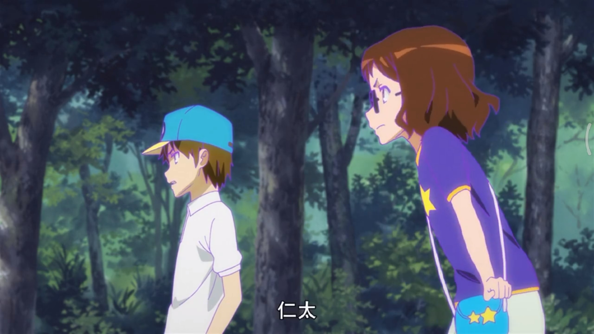

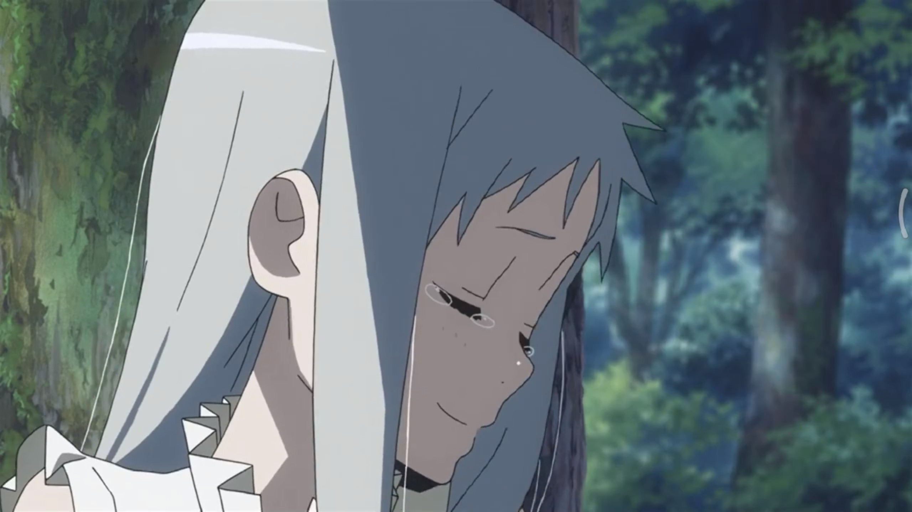

今天我坐在夜市的街边小店吃一份铁板鱼。

实话说做的并不是很精细，但是带着胡椒和辣椒的辣度，勉强可以把饭糊弄下去。

身后是一个男生一个女生并排坐着，台湾的女生真的很平易近人，情绪充沛。

>  “那些品质则主要与安慰、满足和放任有关；因此，它们更为惹人喜爱，尽管有时候显得不是那么有尊严感。
>
> 那些让绝大多数人着迷的人，被人们作为休闲时光的理想伴侣，认为有了他们相伴就不会有忧伤和焦虑，那么这些人绝无显赫的品质，更不会有杰出的优点。”
>
> ----《关于我们崇高与美观念之根源的哲学探讨》 [英]埃德蒙·伯克

朋友起身出去转转，只剩我赌气似的接着就着辣椒扒拉饭。

160台币...还是吃饱比较好...

背后的女生每听一句就格格的笑起来，“你的老板真的会这样吗”。

**如果我学会这一套，如果我承认自己生活的肤浅、没有资本、学习女性的魅力，如果我承认自己的平庸，如果我早点通过失去更重要的东西认识到珍贵。**

你会从外面走进小店吗...艺术大学学期伊始，在这里我们终于不再任务缠身，有足够的精力来约会。

和恋人何必在乎有没有谈论自己呢，你说什么我都-----

亲和、温柔、照顾人，这些品质是可人的但不是崇高的。

我可以像游戏里一样顺畅的接受这样的意识形态吗，只需要点击选项就可以从两个极端横跳。

但是我接受的教育...厮杀豪赌...我没有办法维护那种天真的服从。

对不起，我还是做不到那样应和你。

> 燕飞蝶舞
>
> 各分西东
>
> 满眼是春色酥人心胸
>
> ---- 《 魂萦旧梦 》