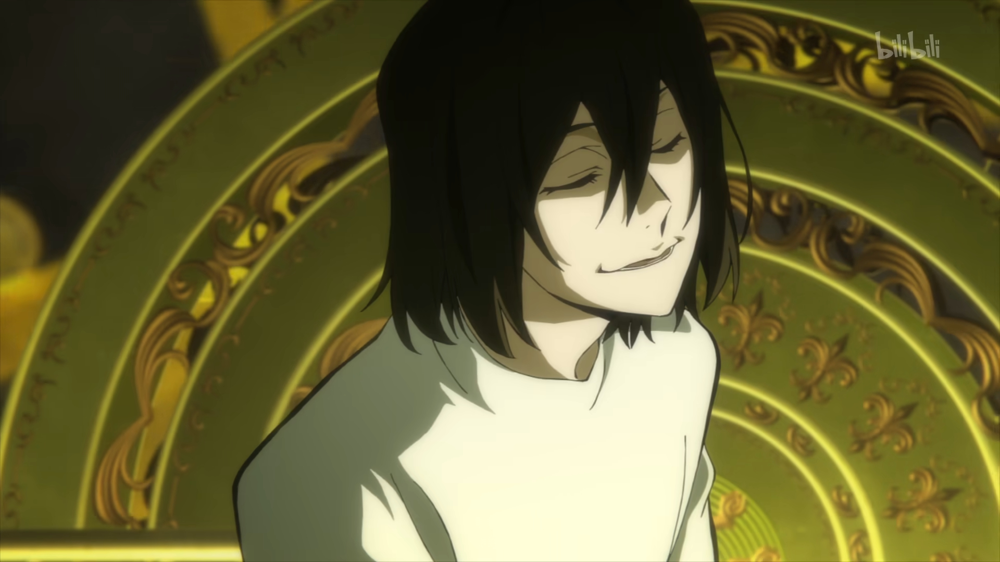
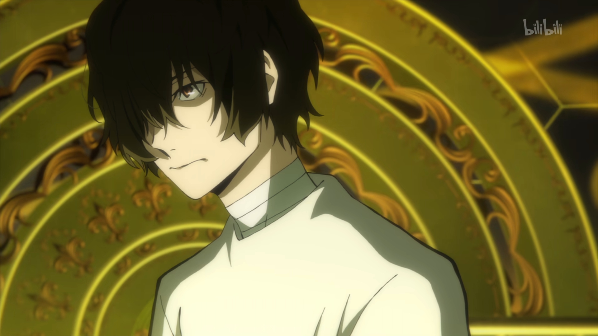
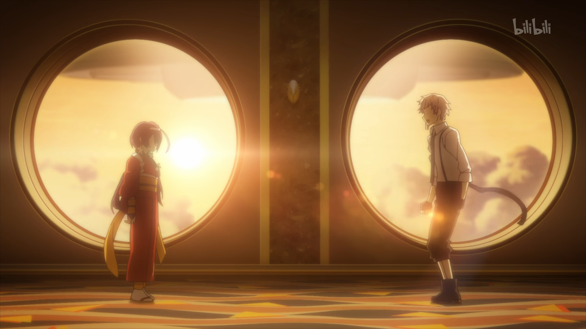
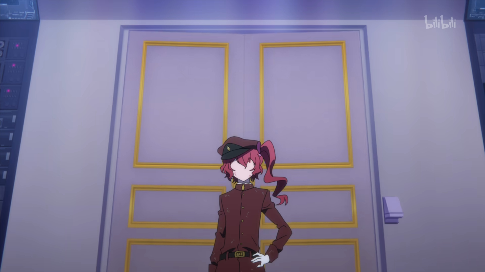
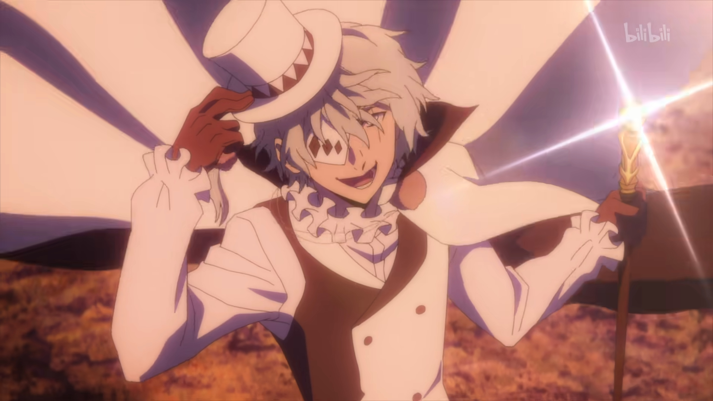
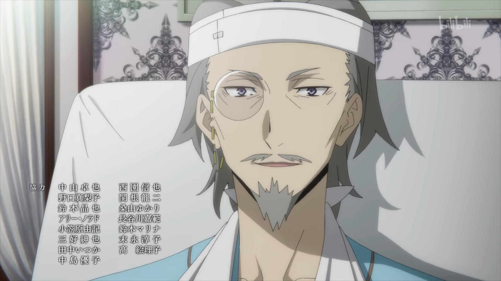
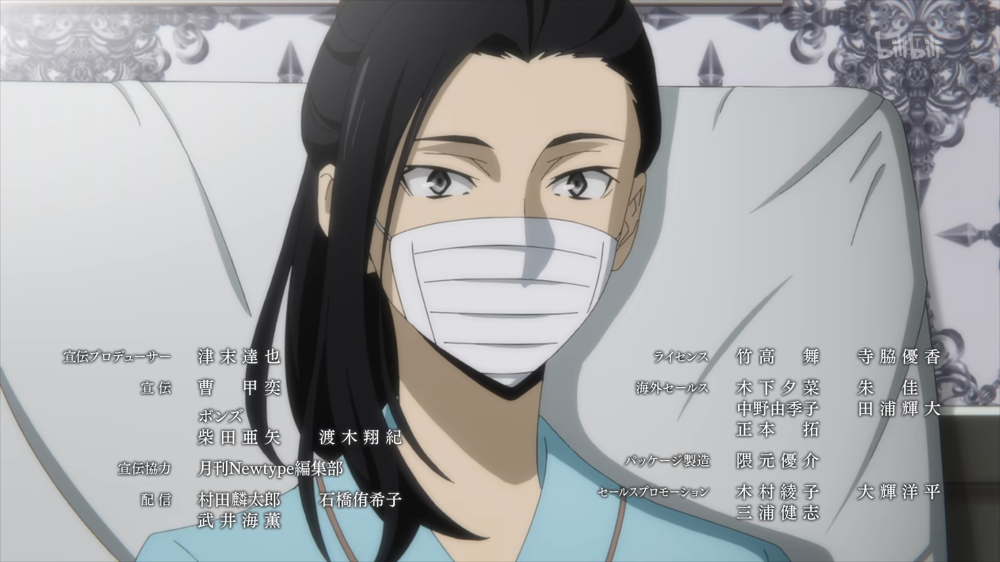

> 在虚构的故事当中寻求真实感的人脑袋一定有问题

所以我从感性的角度谈谈文野S4E13，

这一期谈了秩序和神。

动漫给人带来的感受已经不是可以和其他的视频混为一谈的了。文豪野犬从1-4季，有剧情混乱的地方（我只能期盼着见到太宰en看下去），也有达到艺术品水准的地方。拆开来看，不过是画面，对白，音乐。

啊啊啊啊啊啊啊啊啊啊啊啊啊啊啊啊但是文野这三点统统做到极致了。画面不必多说，只要经费给了的地方，绝对包您满意。

对白，大抵分为：

| 效果     | 人物                         |
| -------- | ---------------------------- |
| 邪魅     | 太宰、森鸥外、陀思妥耶夫斯基 |
| 正人君子 | 福泽、中岛敦、国木田、坂口   |
| 疯批     | 果戈里、小虫栗、             |

邪魅二人组，不得不说文野真的很喜欢把太宰和他的偶像凑cp

实习生二人组，这一季真的推进故事辛苦啦

这一个镜头很有趣，敦走到右窗前我就知道他得落点了，但是镜花还没到她的落点。

但是为了这个构图，做了一个或许是游戏才会用的处理，镜花一个横跳，很快啊，到了敦的对面。

看着有点突兀，但在动漫的世界里也不是不能接受（

两位疯批

其实果戈里是一个很同情弱小的作家，他的喜剧内核是压抑无助的。或许这也是文野的特色反转吧。

都很有魅力啦，干听着声优的声音就可以下饭的那种（

剩下的角色过于有个人特色，或者缺乏特色沦为打杂，不表。

