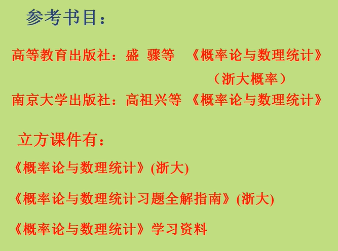
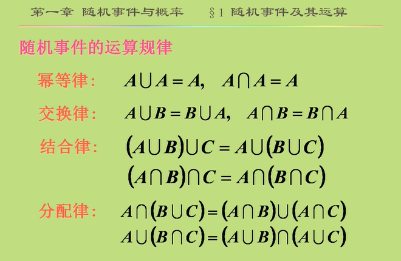
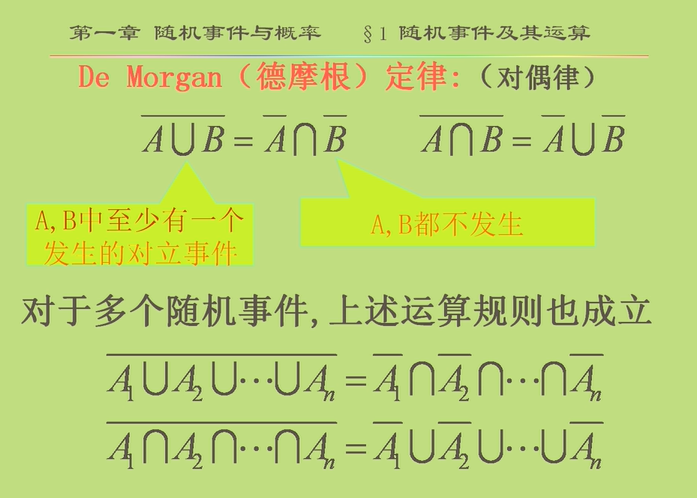
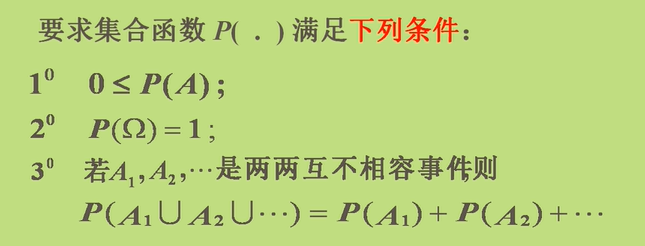
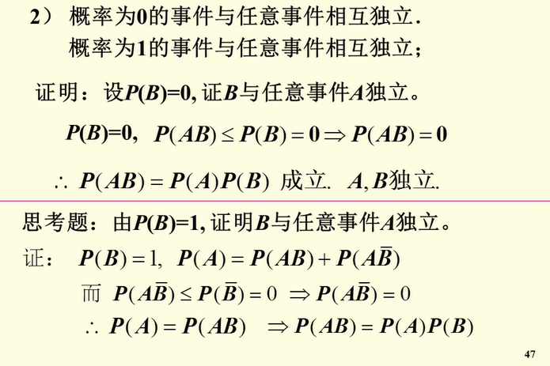
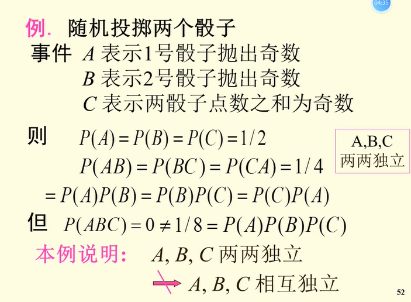
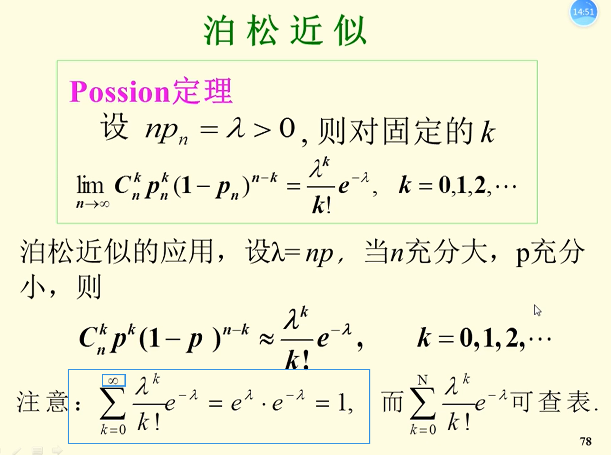
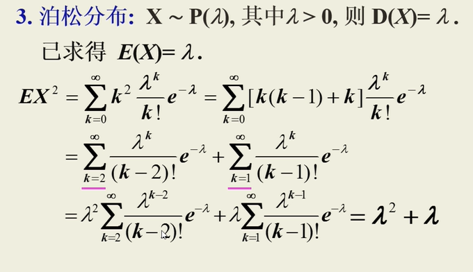
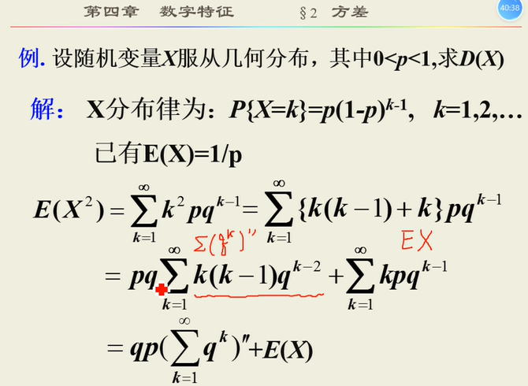

title:  概率论与数理统计笔记
date: 2022-09-05 09:00:00
categories:
- 学习
tags:
- 概率论与数理统计

# 概率论与数理统计

**南京大学计算机科学与技术系2022秋课程 概率论与数理统计 个人笔记**

欢迎批评补充，学术交流，您可以邮件联系我（邮箱见页面底端）

**课程名：**

概率论与数理统计

**英文名：**

Probability and Mathematical Statistics

**建议教材：**

《概率论与数理统计》，傅冬生等编，科学出版社，2014.

**教学周历：**

| 周次 | 教学内容                                                     | 教师   | 授课方式 | 备注          |
| ---- | ------------------------------------------------------------ | ------ | -------- | ------------- |
| 1    | 第一章.随机事件与概率 §1.随机事件及其运算 §2.事件的概率与性质 §3.古典概率 | 傅冬生 | 课堂教学 | 2022年9月5日  |
| 2    | 第一章.随机事件与概率 §4.几何概率 §5.条件概率 §6.独立性      | 傅冬生 | 课堂教学 | 2022年9月19日 |
| 3    | 第一章.随机事件与概率 §7.独立重复试验 第二章 随机变量及其概率分布 §1 随机变量及其分布函数 | 傅冬生 | 课堂教学 |               |
| 4    | 第二章 随机变量及其概率分布 §2 离散型随机变量及其分布函数 §3 连续型随机变量及其分布 | 傅冬生 | 课堂教学 |               |
| 5    | 第二章 随机变量及其概率分布 §4 随机变量函数的分布 第三章 随机向量及其概率分布 §1 二维随机向量及其分布函数 | 傅冬生 | 课堂教学 |               |
| 6    | 第三章 随机向量及其概率分布 §2 二维离散型随机向量 §3 二维连续型随机向量 | 傅冬生 | 课堂教学 |               |
| 7    | 第三章 随机向量及其概率分布 §3 二维连续型随机向量 §4 二维随机向量函数的分布 | 傅冬生 | 课堂教学 |               |
| 8    | 第四章 随机变量的数字特征 §1 数学期望 §2 方差与矩            | 傅冬生 | 课堂教学 |               |
| 9    | 第四章 随机变量的数字特征 §2 方差与矩 §3 协方差与相关系数    | 傅冬生 | 课堂教学 |               |
| 10   | 第五章 极限理论 §1 大数定律 §2 中心极限定理                  | 傅冬生 | 课堂教学 |               |
| 11   | 第六章 统计基础 §1 总体与样本 §2 统计量与抽样分布            | 傅冬生 | 课堂教学 |               |
| 12   | 第六章 统计基础 §3正态总体的抽样分布 第七章 参数估计 §1 矩估计 | 傅冬生 | 课堂教学 |               |
| 13   | 第七章 参数估计 §2 极大似然估计 §3 估计量的评价标准          | 傅冬生 | 课堂教学 |               |
| 14   | 第七章 参数估计 §4 区间估计 第八章 假设检验 §1 假设检验的基本概念 | 傅冬生 | 课堂教学 |               |
| 15   | 第八章 假设检验 §2 正态总体均值的假设检验 §3 正态总体方差的假设检验 | 傅冬生 | 课堂教学 |               |
| 16   | 第八章 假设检验 §3 正态总体方差的假设检验 §4 分布拟合检验    | 傅冬生 | 课堂教学 |               |

### 绪论

## 1.  随机事件及其运算

### 一. 随机试验 样本空间 随机事件

#### 1.随机试验

日常生活和社会实践中的两类现象:确定性现象和随机现象。
具有不确定性(或偶然性)的现象称为**随机现象**。
把对某种随机现象的一次观测或测量称为一个**试验**。

#### 2. 样本空间(sample space)

将随机试验E的所有可能结果组成的集合称为**样本空间**，
样本空间的元素，即E的每个结果，称为**样本点**(或**基本事件**)

#### 3.随机事件(random occurrence)

**基本事件**: 一个样本点组成的单点集，不可再分.
**随机事件**: 称试验E的样本空间L的子集为E的随机事件，记作A,B, C等等;
eg: 事件A:出现偶数点，A={2, 4, 6}

**随机事件发生**:该事件所包含的一一个样本点在试验中出现。

#### 两个特殊的事件:

**必然事件**:样本空间本身;
**不可能事件**:空集

### 二、事件间的关系与运算

#### I. 关系

##### 1) 包含关系B>A

如果A发生必**导致**B发生，

##### 2) 互斥关系

n个事件互斥

##### 3）相等关系

#### II. 运算

并/交/差/对立

## 2. 事件的概率及性质

### 一. 频率的定义和性质

定义:在相同的条件下，进行了n次试验，在这n次试验中，事件A发生的次数na,称为事件A发生的**频数**。比值na/n称为事件A发生的**频率**，并记成f,(A) 。

**频率的稳定性**
在充分多次试验中，事件的频率总在一个定值附近摆动，而且，试验次数越多，一般来说摆动越小.这个性质叫做频率的稳定性.

公理化的def：

## **3.等可能概率(古典概型)**

有限等可能

1）样本空间有限

2）每个等可能

## 6.独立性

### 6.1 性质

1）定义$A,B$满足$P(AB)=P(A)P(B)$，称事件$AB$相互独立 

- 理解$P(B|A) = P(B)$

2）概率为0|1 于任意事件

3) 定理：以下情形等价 **对称性**

- $AB$相互独立
- $\overline{A}B$相互独立
- $A\overline{B}$相互独立
- $\overline{A}\overline{B}$相互独立

4）分组独立性

将上述$n$个事件划分成**没有公共事件**的$k$组，每组中的事件做任意事件运算，得到的$k$个新事件仍相互独立

***相互独立！=互不相容**

证明 见笔记

### 6.2 多个事件独立

#### **6.21 数量**

即任意的$2,3,...,n$个事件拿出来都满足上述等式（共有$C_n^2+C_n^3+...+C_n^n=2^n-n-1个等式$）

#### 6.22 相互独立事件至少发生一个

**加法公式简化**：$A_i$相互独立，则$P(A_1\bigcup A_2\bigcup...\bigcup A_n)=1-P(\overline{ {A_1}\bigcup{A_2}\bigcup...\bigcup{A_n} })= 1-P({\overline{A_1}\bigcap\overline{A_2}\bigcap...\bigcap\overline{A_} }})=1-P(\overline{A_1})P(\overline{A_2})...P(\overline{A_n})$

#### 6.23 小概率事件原理

书p19

#### 可靠性

串联 并联 

书1.25 笔记两两并再串联

桥式系统

## 7. 独立重复实验

## 方差

泊松分布

几何分布

