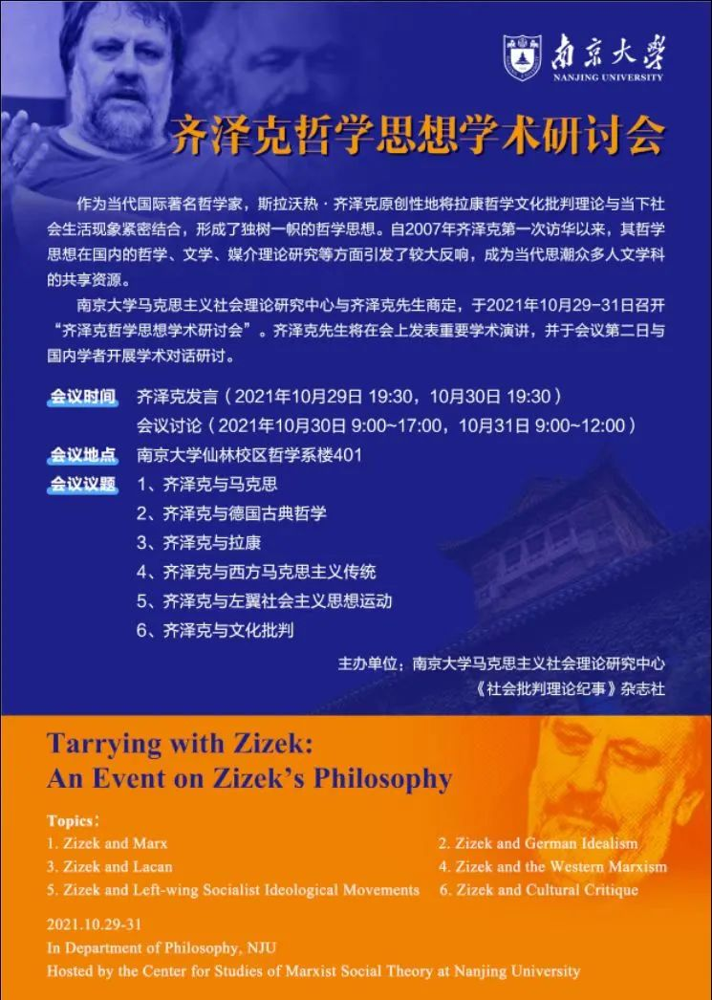
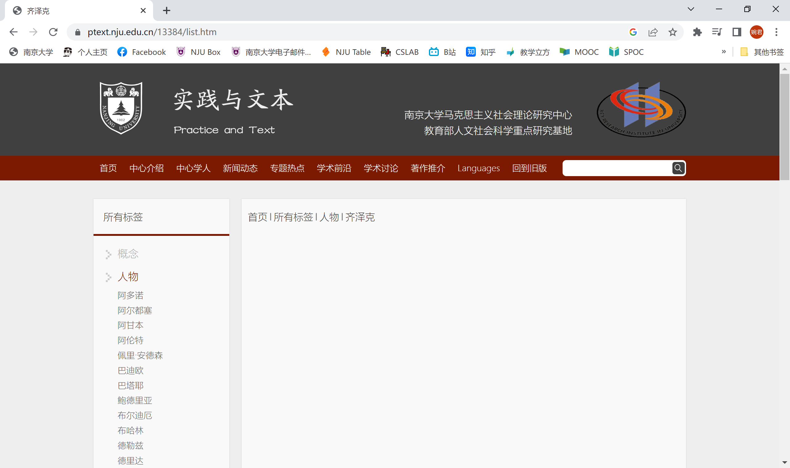

 

**齐泽克《变态者电影指南》The Pervert's Guide to Cinema（2006）**

链接：

<iframe src="//player.bilibili.com/player.html?aid=587760424&bvid=BV1EB4y1c73H&cid=331322455&page=1" scrolling="no" border="0" frameborder="no" framespacing="0" allowfullscreen="true" width="100%"> </iframe>
顺便，回顾原片的时候发现还有一个**《变态者意识形态指南》The Pervert's Guide to Ideology (2012)**

多么大气的名字，恐怕只有当代哲圣未明子 ”主义主义“ （Ismism ）一词，可与之抗衡！

链接：[纪录片 变态者意识形态指南 The Pervert's Guide to Ideology (2012) | CC字幕]( https://www.bilibili.com/video/BV1Er4y1M769/?share_source=copy_web&vd_source=a835c0479f1ae10e33e10aa2fa40f07e)

## 一. 絮叨

来自 [徐明瀚](http://rhizome-cinema.blogspot.com/) 老师的《電影評論》课

本周不讲课，因为老师唔，支气管炎了，说话都是气音。

老师特意强调核酸不是阳哈哈哈，说给带了个好电影大家看。

> 老师：”有个哲学家。名字叫什么我忘了。“
>
> 我小声bb：”齐泽克''
>
> 老师：”啊 Zizek“

齐泽克，繁体写作

> #### 插播一个南哪笑话 if you like

​	 

南大旧笑话 最终齐泽克没能在这个齐泽克研讨会上发言

南大新笑话 齐泽克查无此人

## 二. 简介

> 由英国女导演索菲亚·菲尼斯执导，由斯拉沃热·齐泽克（Slavoj Zizek）担当编剧、主持人的纪录片《变态者电影指南》，为电影发烧友呈现一部殿堂级的饕餮盛宴。 在长达150分钟的影片中，斯拉沃热·齐泽克妙语连珠，引用希区柯克、大卫·林奇、塔可夫斯基、沃卓斯基兄弟等著名导演拍摄的42部经典电影桥段，将精神分析、主体性、意识形态和大众文化熔于一炉，探秘电影背后的隐匿镜头语言，引导观众思辨自身与电影之间的联系。
>
> --bilibili   [Z_Empty](https://space.bilibili.com/9551781) 

## 三. 开扯

未完。。。