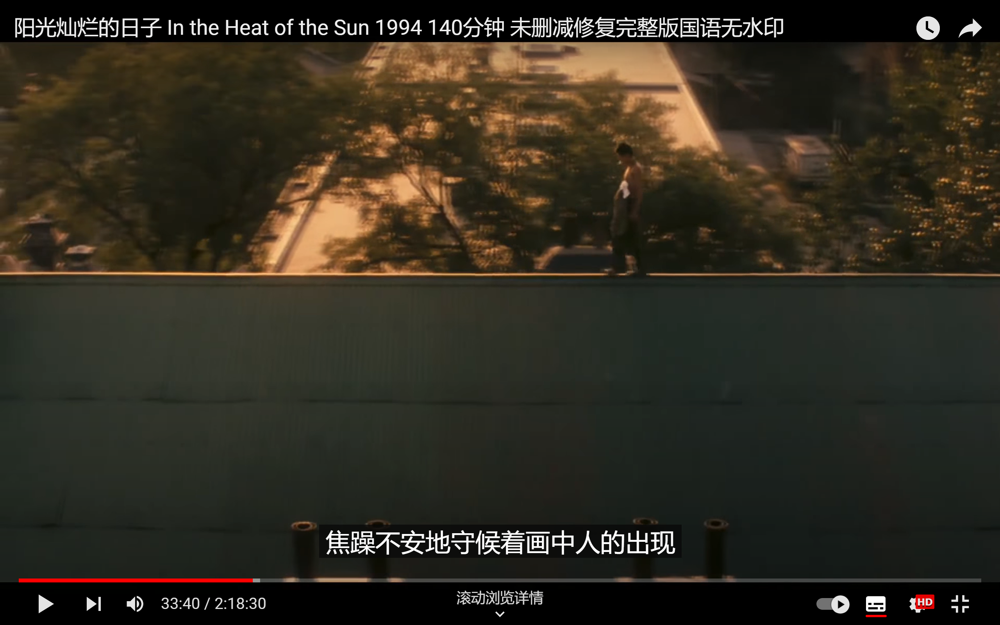
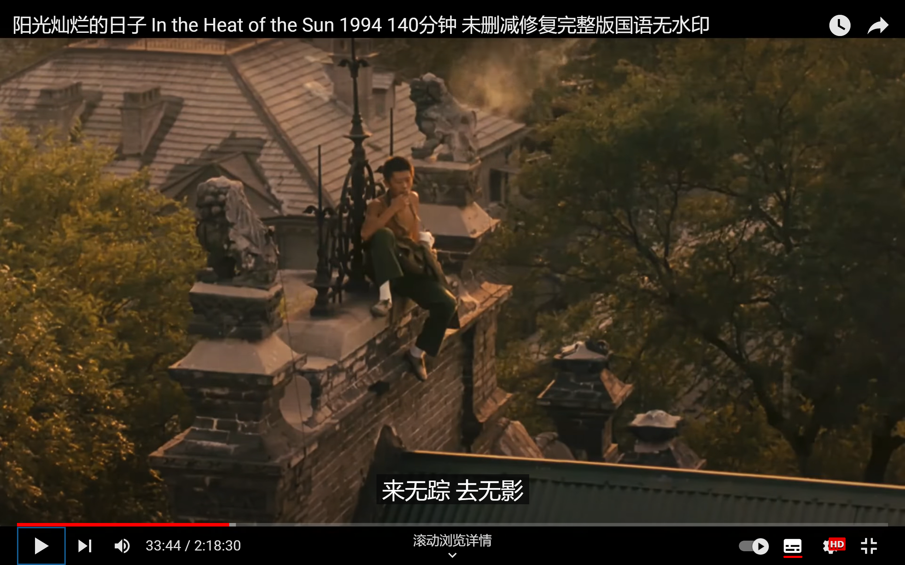
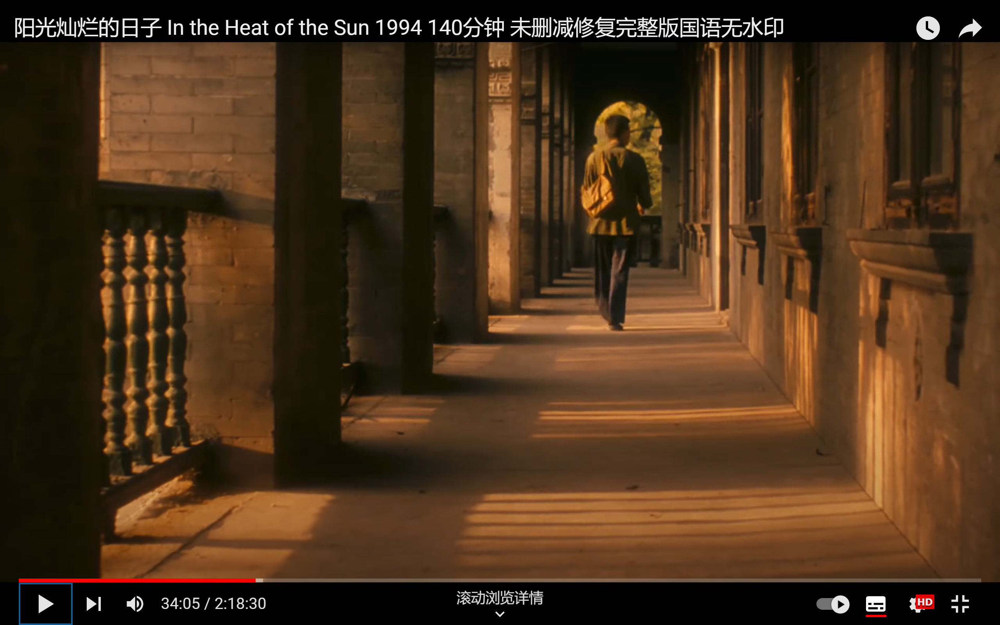
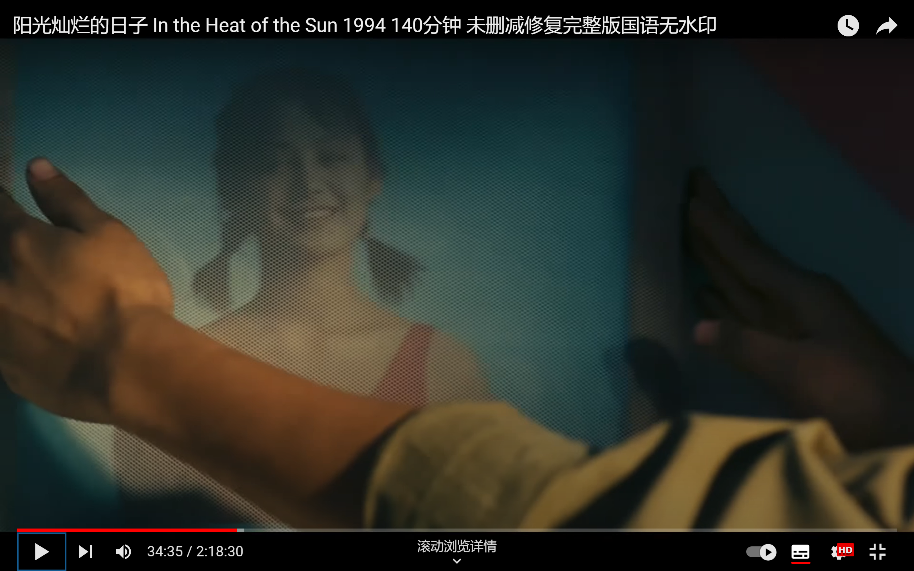
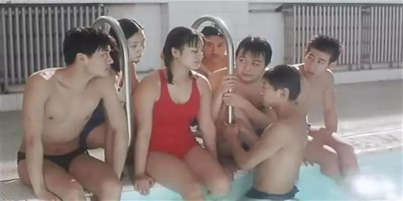

>  Always free girl 2022/6/29 0:00:42
> 看姜文的社会主义回忆录共鸣不起来
>
> Always free girl 2022/6/29 0:01:00
> 还是资本主义60s能理解

 看到这我觉得这部片子有点陷入了回忆的感性里。宽敞的屋子，没有父母的空间。青色的屋顶，甚至没有衣物的出现。同样是军区大院，这个90年代住的比我00年代的环境都雅致。

正红旗老少爷塔顶抽烟

相似的走廊 红少爷在这怀春

红泳衣 典

是不是北京的老少爷都对这个红泳衣，有点不同寻常的爱好。《芳华》里面也出现过。

  

红泳衣 芳华

美则美矣，是不是有点那个资本主义的那味？

哦，这不是资本主义啊，这是苏修！我来找一找。

没找到。反正是那种社会主义红千金的感觉。

>  初看《芳华》这张海报，浓烈的色彩和快要溢出的青春气息让我第一时间就想到了《阳光灿烂的日子》，可能同为**部队大院**出身，姜文和冯小刚对青春的记忆都近乎于相似。 
>
>  在《晓说》里冯小刚说：**回想那时总有阳光，在被照得金灿灿的水波粼粼里浮现出一张张生动的脸。** 

诶，找图片的时候看见这段，对头。这种审美，典型的北京部队大院老少爷。

他们的电影有诡异的空间，这些阳光灿烂的走廊，究竟是作何用处？主人公走走停停，男生女生打闹，他们不要上学，不要上班？家里整整齐齐，看不出什么生活痕迹。不，更可怕的是他试图伪装出生活的痕迹。

在这种虚幻的场景，插入这几个中年人当年的性幻想，阳光灿烂的日子，我呸。

还不如《让我们荡起双桨》呢，虽然北京阔少的日子我们过不上，好歹颂盛世里带着一股乐极生悲的忧伤，能和我等匹配匹配。

